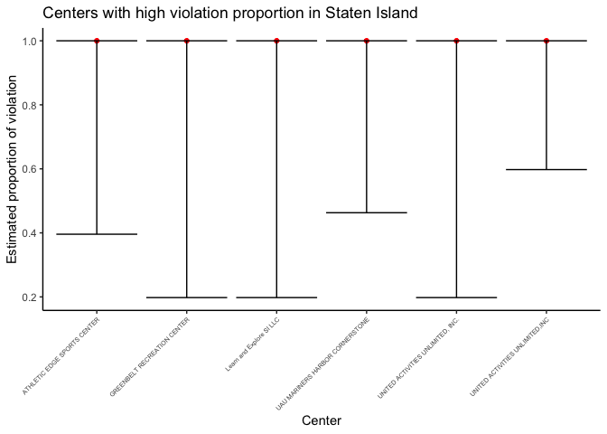
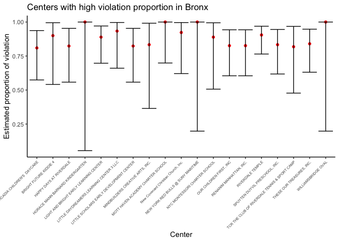
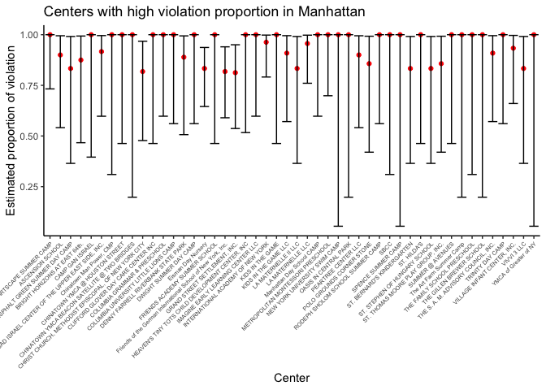
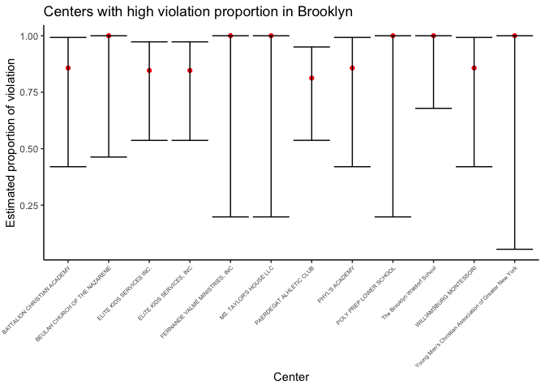
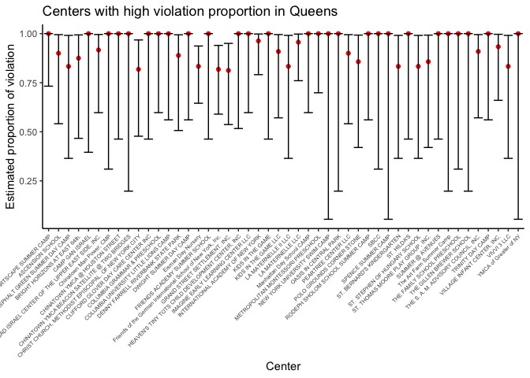

Statistical analysis
================
Qing Zhou
2022-12-09

``` r
library(tidyverse)
library(dplyr)
library(rvest)
library(purrr)
library(ggplot2)
library(modelr)
library(mgcv)
library(patchwork)
library(viridis)
library(fastDummies)
set.seed(1)
```

1.  Import original dataset

2.  Remove repeated data

``` r
childcare_inspection_df = read_csv("./data/DOHMH_Childcare_Center_Inspections.csv") %>% 
janitor::clean_names() %>% 
distinct()
```

    ## Rows: 26280 Columns: 34
    ## ── Column specification ─────────────────────────────────────────────
    ## Delimiter: ","
    ## chr (22): Center Name, Legal Name, Building, Street, Borough, Phone, Permit ...
    ## dbl (11): ZipCode, Permit Number, Building Identification Number, Violation ...
    ## 
    ## ℹ Use `spec()` to retrieve the full column specification for this data.
    ## ℹ Specify the column types or set `show_col_types = FALSE` to quiet this message.

Basic data cleaning

1.  We select 22 key variables in this dataset to finish our analysis

2.  Drop NA

3.  Create a new variable “educational_worker_ratio”

4.  Make all data in “program_type” and “facility_type” columns show in
    the same format : lower case

``` r
childcare_inspection_df = childcare_inspection_df %>% 
  select(center_name, borough, zip_code, status, age_range, maximum_capacity,program_type, facility_type, 
         child_care_type, violation_category,
         violation_status,violation_rate_percent:average_critical_violation_rate,regulation_summary,
         inspection_summary_result) %>%
  drop_na(zip_code, age_range, violation_rate_percent,public_health_hazard_violation_rate, critical_violation_rate) %>% 
  filter(maximum_capacity != 0) %>% 
  mutate(
    educational_worker_ratio = total_educational_workers/maximum_capacity,
    program_type = tolower(program_type),
    facility_type = tolower(facility_type),
    borough =  as.factor(borough),
    status = as.factor(status),
    program_type = as.factor(program_type),
    facility_type = as.factor(facility_type),
    child_care_type = as.factor(child_care_type),
    age_range = as.factor(age_range)
  ) 
```

We calculated a new violation rate for each distinct program using
violation category column.

``` r
center_specific_df = childcare_inspection_df %>% 
  relocate(center_name, program_type) %>% 
  group_by(center_name, program_type) %>% 
  mutate(
    n_na = sum(is.na(violation_category)), 
    n_violation = sum(!is.na(violation_category)), 
    rate = n_violation/(n_violation + n_na)) %>% 
  arrange(center_name, program_type)
```

### Statistical analysis

#### 1. Anova test - Violation Cases Number and Boroughs

We are curious about whether center location is associated with the
frequency of their violation. For example, during the past 3 years,
would the expected violation case number in a random center in Bronx
varies from the expected violation case number in a random center in
Manhattan? To explore the answer, We performed ANOVA test across
boroughs.

Our hypothesis is:

H0: The average number of violation in each center are not different
across boroughs

H1: The average number of violation in each center are not different
across boroughs

``` r
# select distinct records of each center

center_distinct_df_2 = center_specific_df %>%
  select(center_name, program_type, borough, status, maximum_capacity, total_educational_workers, educational_worker_ratio, n_violation, rate) %>%
  distinct()

# total violation number of each center
vio_boro = center_distinct_df_2 %>%
  group_by(borough, center_name) %>%
  summarize(n_violate = sum(n_violation)) %>%
  arrange(center_name)
```

    ## `summarise()` has grouped output by 'borough'. You can override
    ## using the `.groups` argument.

``` r
# anova
fit_borough = lm(n_violate ~ borough, data = vio_boro)
summary(fit_borough)
```

    ## 
    ## Call:
    ## lm(formula = n_violate ~ borough, data = vio_boro)
    ## 
    ## Residuals:
    ##     Min      1Q  Median      3Q     Max 
    ## -11.547  -4.148  -2.450   0.611 243.852 
    ## 
    ## Coefficients:
    ##                      Estimate Std. Error t value Pr(>|t|)    
    ## (Intercept)           11.5468     0.9719  11.881  < 2e-16 ***
    ## boroughBROOKLYN       -7.6286     1.1113  -6.865 9.19e-12 ***
    ## boroughMANHATTAN      -5.3993     1.1805  -4.574 5.12e-06 ***
    ## boroughQUEENS         -5.1575     1.1968  -4.309 1.73e-05 ***
    ## boroughSTATEN ISLAND  -8.0968     1.6917  -4.786 1.84e-06 ***
    ## ---
    ## Signif. codes:  0 '***' 0.001 '**' 0.01 '*' 0.05 '.' 0.1 ' ' 1
    ## 
    ## Residual standard error: 13.85 on 1778 degrees of freedom
    ## Multiple R-squared:  0.02789,    Adjusted R-squared:  0.0257 
    ## F-statistic: 12.75 on 4 and 1778 DF,  p-value: 3.106e-10

``` r
anova(fit_borough) %>% knitr::kable(caption = "One way anova of violation frequency and borough")
```

|           |   Df |     Sum Sq |   Mean Sq |  F value | Pr(\>F) |
|:----------|-----:|-----------:|----------:|---------:|--------:|
| borough   |    4 |   9779.026 | 2444.7565 | 12.75074 |       0 |
| Residuals | 1778 | 340903.777 |  191.7344 |       NA |      NA |

One way anova of violation frequency and borough

*Conclusion:* The p-value of the above Anova test is 3.106e-10. Thus, at
0.05 significance level, we reject the null hypothesis and conclude that
during the past 3 years, the average number of violations per center
varies across boroughs.

#### 2. Chi-square Test - 3 Violation Types and Boroughs

In this dataset, there are three violation types exist: critical
violation, general violation and public health hazard violation. We’re
interested if the proportion of each type of violation would vary among
different boroughs. So we calculated the total number of cases under
each violation category in each borough and did a chi-square test to see
if this proportion is associated with its location.

Our hypothesis is:

H0: the proportions of ciritical violation among borough levels are
equal; AND the proportions of general violation among borough levels are
equal; AND the proportions of public health hazard violation among
borough levels are equal; vs. H1: not all proportions are equal.

``` r
three_violation = 
  childcare_inspection_df %>%
  select(borough, violation_category) %>% 
  filter(violation_category != "NA")  %>% 
  count(borough, violation_category,) %>% 
  pivot_wider(
    names_from = "violation_category",
    values_from = "n"
  ) %>% 
  data.matrix() %>% 
  subset(select = -c(borough))

rownames(three_violation) <- c("Bronx", "Brooklyn", "Manhattan", "Queens", "Staten Island")

three_violation %>% 
  knitr::kable(caption = "Results Table")
```

|               | CRITICAL | GENERAL | PUBLIC HEALTH HAZARD |
|:--------------|---------:|--------:|---------------------:|
| Bronx         |      816 |     798 |                  192 |
| Brooklyn      |      806 |     797 |                  296 |
| Manhattan     |      514 |     944 |                  204 |
| Queens        |      784 |     972 |                  270 |
| Staten Island |       80 |     118 |                   25 |

Results Table

``` r
chisq.test(three_violation)
```

    ## 
    ##  Pearson's Chi-squared test
    ## 
    ## data:  three_violation
    ## X-squared = 118.01, df = 8, p-value < 2.2e-16

*Conclusion:* At 0.05 significance level, χ2\>χcritical, with p-value \<
2.2e-16. Thus, we reject the null hypothesis and conclude that there is
sufficient evidence that the proportion of violation category is
significantly different by borough.

#### 3. Proportion Test - Total Violation Proportion within Center

With the belief that violation record is an important parameter to
evaluate the performance of a child healthcare center, we conducted a
proportion test to estimate the total violation proportion and its 95%
confidence interval for each center, regardless of its program type. We
defined the estimated total violation proportion \> 0.8 as high
proportion. Next, we pinpointed all the centers with high violation
proportion in each borough.

``` r
# Divide the inspection results as violated vs. not violated
vio_sum = 
center_specific_df %>%
mutate(
    verdiction = case_when(
      violation_category == "NA" ~ "not violated",
      violation_category == "GENERAL"  ~ "violated",
      violation_category == "CRITICAL"   ~ "violated",
      violation_category == "PUBLIC HEALTH HAZARD"   ~ "violated")
  ) %>% 
 select(center_name, program_type, borough, verdiction)
```

``` r
# Summary of the total number of inspection and the total number of violation within center
verdiction_center = 
  vio_sum %>% 
  mutate(verdiction = as.character(verdiction)) %>%
  group_by(center_name,borough) %>% 
  summarize(
    inspect_total = n(),
    inspect_vio = sum(!is.na(verdiction)))
```

    ## `summarise()` has grouped output by 'center_name'. You can override
    ## using the `.groups` argument.

``` r
# prop.test for all centers in staten island
center_prop_staten = 
  verdiction_center %>% 
  filter(borough == "STATEN ISLAND") %>%
  mutate(
    prop_result = map2(.x = inspect_vio, .y = inspect_total, ~prop.test(x = .x, n = .y)),
    tidy_result = map(.x = prop_result, ~broom::tidy(.x))
  ) %>% 
  select(-prop_result) %>% 
  unnest(tidy_result) %>% 
  select(center_name, estimate, conf.low, conf.high)
```

    ## Warning in prop.test(x = .x, n = .y): Chi-squared approximation may be incorrect

    ## Warning in prop.test(x = .x, n = .y): Chi-squared approximation may be incorrect

    ## Warning in prop.test(x = .x, n = .y): Chi-squared approximation may be incorrect

    ## Warning in prop.test(x = .x, n = .y): Chi-squared approximation may be incorrect

    ## Warning in prop.test(x = .x, n = .y): Chi-squared approximation may be incorrect

    ## Warning in prop.test(x = .x, n = .y): Chi-squared approximation may be incorrect

    ## Warning in prop.test(x = .x, n = .y): Chi-squared approximation may be incorrect

    ## Warning in prop.test(x = .x, n = .y): Chi-squared approximation may be incorrect

    ## Warning in prop.test(x = .x, n = .y): Chi-squared approximation may be incorrect

    ## Warning in prop.test(x = .x, n = .y): Chi-squared approximation may be incorrect

    ## Warning in prop.test(x = .x, n = .y): Chi-squared approximation may be incorrect

    ## Warning in prop.test(x = .x, n = .y): Chi-squared approximation may be incorrect

    ## Warning in prop.test(x = .x, n = .y): Chi-squared approximation may be incorrect

    ## Warning in prop.test(x = .x, n = .y): Chi-squared approximation may be incorrect

    ## Warning in prop.test(x = .x, n = .y): Chi-squared approximation may be incorrect

    ## Warning in prop.test(x = .x, n = .y): Chi-squared approximation may be incorrect

    ## Warning in prop.test(x = .x, n = .y): Chi-squared approximation may be incorrect

    ## Warning in prop.test(x = .x, n = .y): Chi-squared approximation may be incorrect

    ## Warning in prop.test(x = .x, n = .y): Chi-squared approximation may be incorrect

    ## Warning in prop.test(x = .x, n = .y): Chi-squared approximation may be incorrect

    ## Warning in prop.test(x = .x, n = .y): Chi-squared approximation may be incorrect

    ## Warning in prop.test(x = .x, n = .y): Chi-squared approximation may be incorrect

    ## Warning in prop.test(x = .x, n = .y): Chi-squared approximation may be incorrect

    ## Warning in prop.test(x = .x, n = .y): Chi-squared approximation may be incorrect

    ## Warning in prop.test(x = .x, n = .y): Chi-squared approximation may be incorrect

    ## Warning in prop.test(x = .x, n = .y): Chi-squared approximation may be incorrect

    ## Warning in prop.test(x = .x, n = .y): Chi-squared approximation may be incorrect

    ## Warning in prop.test(x = .x, n = .y): Chi-squared approximation may be incorrect

    ## Warning in prop.test(x = .x, n = .y): Chi-squared approximation may be incorrect

    ## Warning in prop.test(x = .x, n = .y): Chi-squared approximation may be incorrect

    ## Warning in prop.test(x = .x, n = .y): Chi-squared approximation may be incorrect

    ## Warning in prop.test(x = .x, n = .y): Chi-squared approximation may be incorrect

    ## Warning in prop.test(x = .x, n = .y): Chi-squared approximation may be incorrect

    ## Warning in prop.test(x = .x, n = .y): Chi-squared approximation may be incorrect

    ## Warning in prop.test(x = .x, n = .y): Chi-squared approximation may be incorrect

    ## Warning in prop.test(x = .x, n = .y): Chi-squared approximation may be incorrect

    ## Warning in prop.test(x = .x, n = .y): Chi-squared approximation may be incorrect

    ## Warning in prop.test(x = .x, n = .y): Chi-squared approximation may be incorrect

    ## Warning in prop.test(x = .x, n = .y): Chi-squared approximation may be incorrect

    ## Warning in prop.test(x = .x, n = .y): Chi-squared approximation may be incorrect

    ## Warning in prop.test(x = .x, n = .y): Chi-squared approximation may be incorrect

    ## Warning in prop.test(x = .x, n = .y): Chi-squared approximation may be incorrect

    ## Warning in prop.test(x = .x, n = .y): Chi-squared approximation may be incorrect

    ## Warning in prop.test(x = .x, n = .y): Chi-squared approximation may be incorrect

    ## Warning in prop.test(x = .x, n = .y): Chi-squared approximation may be incorrect

    ## Warning in prop.test(x = .x, n = .y): Chi-squared approximation may be incorrect

    ## Warning in prop.test(x = .x, n = .y): Chi-squared approximation may be incorrect

    ## Warning in prop.test(x = .x, n = .y): Chi-squared approximation may be incorrect

    ## Warning in prop.test(x = .x, n = .y): Chi-squared approximation may be incorrect

    ## Warning in prop.test(x = .x, n = .y): Chi-squared approximation may be incorrect

    ## Warning in prop.test(x = .x, n = .y): Chi-squared approximation may be incorrect

    ## Warning in prop.test(x = .x, n = .y): Chi-squared approximation may be incorrect

    ## Warning in prop.test(x = .x, n = .y): Chi-squared approximation may be incorrect

    ## Warning in prop.test(x = .x, n = .y): Chi-squared approximation may be incorrect

    ## Warning in prop.test(x = .x, n = .y): Chi-squared approximation may be incorrect

    ## Warning in prop.test(x = .x, n = .y): Chi-squared approximation may be incorrect

    ## Warning in prop.test(x = .x, n = .y): Chi-squared approximation may be incorrect

    ## Warning in prop.test(x = .x, n = .y): Chi-squared approximation may be incorrect

    ## Warning in prop.test(x = .x, n = .y): Chi-squared approximation may be incorrect

    ## Warning in prop.test(x = .x, n = .y): Chi-squared approximation may be incorrect

    ## Warning in prop.test(x = .x, n = .y): Chi-squared approximation may be incorrect

    ## Warning in prop.test(x = .x, n = .y): Chi-squared approximation may be incorrect

    ## Warning in prop.test(x = .x, n = .y): Chi-squared approximation may be incorrect

    ## Warning in prop.test(x = .x, n = .y): Chi-squared approximation may be incorrect

    ## Warning in prop.test(x = .x, n = .y): Chi-squared approximation may be incorrect

    ## Warning in prop.test(x = .x, n = .y): Chi-squared approximation may be incorrect

    ## Warning in prop.test(x = .x, n = .y): Chi-squared approximation may be incorrect

    ## Warning in prop.test(x = .x, n = .y): Chi-squared approximation may be incorrect

    ## Warning in prop.test(x = .x, n = .y): Chi-squared approximation may be incorrect

    ## Warning in prop.test(x = .x, n = .y): Chi-squared approximation may be incorrect

    ## Warning in prop.test(x = .x, n = .y): Chi-squared approximation may be incorrect

    ## Warning in prop.test(x = .x, n = .y): Chi-squared approximation may be incorrect

    ## Warning in prop.test(x = .x, n = .y): Chi-squared approximation may be incorrect

    ## Warning in prop.test(x = .x, n = .y): Chi-squared approximation may be incorrect

``` r
# a plot that shows the estimates and CIs for each center in staten island with the proportion of violation greater than 0.8
center_prop_staten %>% 
  filter(estimate > 0.8) %>%
  mutate(center_name = factor(center_name)) %>% 
  mutate(center_name = forcats::fct_reorder(center_name, estimate)) %>% 
  
  ggplot(aes(x = center_name, y = estimate)) +
  geom_point(color = "red") +
  geom_errorbar(aes(ymin = conf.low, ymax = conf.high)) +

  theme(axis.text.x = element_text(angle = 45, hjust = 1, size = rel(0.6))) +
  labs( x = "Center",
    y = "Estimated proportion of violation",
    title = "Centers with high violation proportion in Staten Island")
```

<!-- -->

``` r
# prop.test for all centers in Bronx
center_prop_bronx = 
  verdiction_center %>% 
  filter(borough == "BRONX") %>%
  mutate(
    prop_result = map2(.x = inspect_vio, .y = inspect_total, ~prop.test(x = .x, n = .y)),
    tidy_result = map(.x = prop_result, ~broom::tidy(.x))
  ) %>% 
  select(-prop_result) %>% 
  unnest(tidy_result) %>% 
  select(center_name, estimate, conf.low, conf.high)
```

    ## Warning in prop.test(x = .x, n = .y): Chi-squared approximation may be incorrect

    ## Warning in prop.test(x = .x, n = .y): Chi-squared approximation may be incorrect

    ## Warning in prop.test(x = .x, n = .y): Chi-squared approximation may be incorrect

    ## Warning in prop.test(x = .x, n = .y): Chi-squared approximation may be incorrect

    ## Warning in prop.test(x = .x, n = .y): Chi-squared approximation may be incorrect

    ## Warning in prop.test(x = .x, n = .y): Chi-squared approximation may be incorrect

    ## Warning in prop.test(x = .x, n = .y): Chi-squared approximation may be incorrect

    ## Warning in prop.test(x = .x, n = .y): Chi-squared approximation may be incorrect

    ## Warning in prop.test(x = .x, n = .y): Chi-squared approximation may be incorrect

    ## Warning in prop.test(x = .x, n = .y): Chi-squared approximation may be incorrect

    ## Warning in prop.test(x = .x, n = .y): Chi-squared approximation may be incorrect

    ## Warning in prop.test(x = .x, n = .y): Chi-squared approximation may be incorrect

    ## Warning in prop.test(x = .x, n = .y): Chi-squared approximation may be incorrect

    ## Warning in prop.test(x = .x, n = .y): Chi-squared approximation may be incorrect

    ## Warning in prop.test(x = .x, n = .y): Chi-squared approximation may be incorrect

    ## Warning in prop.test(x = .x, n = .y): Chi-squared approximation may be incorrect

    ## Warning in prop.test(x = .x, n = .y): Chi-squared approximation may be incorrect

    ## Warning in prop.test(x = .x, n = .y): Chi-squared approximation may be incorrect

    ## Warning in prop.test(x = .x, n = .y): Chi-squared approximation may be incorrect

    ## Warning in prop.test(x = .x, n = .y): Chi-squared approximation may be incorrect

    ## Warning in prop.test(x = .x, n = .y): Chi-squared approximation may be incorrect

    ## Warning in prop.test(x = .x, n = .y): Chi-squared approximation may be incorrect

    ## Warning in prop.test(x = .x, n = .y): Chi-squared approximation may be incorrect

    ## Warning in prop.test(x = .x, n = .y): Chi-squared approximation may be incorrect

    ## Warning in prop.test(x = .x, n = .y): Chi-squared approximation may be incorrect

    ## Warning in prop.test(x = .x, n = .y): Chi-squared approximation may be incorrect

    ## Warning in prop.test(x = .x, n = .y): Chi-squared approximation may be incorrect

    ## Warning in prop.test(x = .x, n = .y): Chi-squared approximation may be incorrect

    ## Warning in prop.test(x = .x, n = .y): Chi-squared approximation may be incorrect

    ## Warning in prop.test(x = .x, n = .y): Chi-squared approximation may be incorrect

    ## Warning in prop.test(x = .x, n = .y): Chi-squared approximation may be incorrect

    ## Warning in prop.test(x = .x, n = .y): Chi-squared approximation may be incorrect

    ## Warning in prop.test(x = .x, n = .y): Chi-squared approximation may be incorrect

    ## Warning in prop.test(x = .x, n = .y): Chi-squared approximation may be incorrect

    ## Warning in prop.test(x = .x, n = .y): Chi-squared approximation may be incorrect

    ## Warning in prop.test(x = .x, n = .y): Chi-squared approximation may be incorrect

    ## Warning in prop.test(x = .x, n = .y): Chi-squared approximation may be incorrect

    ## Warning in prop.test(x = .x, n = .y): Chi-squared approximation may be incorrect

    ## Warning in prop.test(x = .x, n = .y): Chi-squared approximation may be incorrect

    ## Warning in prop.test(x = .x, n = .y): Chi-squared approximation may be incorrect

    ## Warning in prop.test(x = .x, n = .y): Chi-squared approximation may be incorrect

    ## Warning in prop.test(x = .x, n = .y): Chi-squared approximation may be incorrect

    ## Warning in prop.test(x = .x, n = .y): Chi-squared approximation may be incorrect

    ## Warning in prop.test(x = .x, n = .y): Chi-squared approximation may be incorrect

    ## Warning in prop.test(x = .x, n = .y): Chi-squared approximation may be incorrect

    ## Warning in prop.test(x = .x, n = .y): Chi-squared approximation may be incorrect

    ## Warning in prop.test(x = .x, n = .y): Chi-squared approximation may be incorrect

    ## Warning in prop.test(x = .x, n = .y): Chi-squared approximation may be incorrect

    ## Warning in prop.test(x = .x, n = .y): Chi-squared approximation may be incorrect

    ## Warning in prop.test(x = .x, n = .y): Chi-squared approximation may be incorrect

    ## Warning in prop.test(x = .x, n = .y): Chi-squared approximation may be incorrect

    ## Warning in prop.test(x = .x, n = .y): Chi-squared approximation may be incorrect

    ## Warning in prop.test(x = .x, n = .y): Chi-squared approximation may be incorrect

    ## Warning in prop.test(x = .x, n = .y): Chi-squared approximation may be incorrect

    ## Warning in prop.test(x = .x, n = .y): Chi-squared approximation may be incorrect

    ## Warning in prop.test(x = .x, n = .y): Chi-squared approximation may be incorrect

    ## Warning in prop.test(x = .x, n = .y): Chi-squared approximation may be incorrect

    ## Warning in prop.test(x = .x, n = .y): Chi-squared approximation may be incorrect

    ## Warning in prop.test(x = .x, n = .y): Chi-squared approximation may be incorrect

    ## Warning in prop.test(x = .x, n = .y): Chi-squared approximation may be incorrect

    ## Warning in prop.test(x = .x, n = .y): Chi-squared approximation may be incorrect

    ## Warning in prop.test(x = .x, n = .y): Chi-squared approximation may be incorrect

    ## Warning in prop.test(x = .x, n = .y): Chi-squared approximation may be incorrect

    ## Warning in prop.test(x = .x, n = .y): Chi-squared approximation may be incorrect

    ## Warning in prop.test(x = .x, n = .y): Chi-squared approximation may be incorrect

    ## Warning in prop.test(x = .x, n = .y): Chi-squared approximation may be incorrect

    ## Warning in prop.test(x = .x, n = .y): Chi-squared approximation may be incorrect

    ## Warning in prop.test(x = .x, n = .y): Chi-squared approximation may be incorrect

    ## Warning in prop.test(x = .x, n = .y): Chi-squared approximation may be incorrect

    ## Warning in prop.test(x = .x, n = .y): Chi-squared approximation may be incorrect

    ## Warning in prop.test(x = .x, n = .y): Chi-squared approximation may be incorrect

    ## Warning in prop.test(x = .x, n = .y): Chi-squared approximation may be incorrect

    ## Warning in prop.test(x = .x, n = .y): Chi-squared approximation may be incorrect

    ## Warning in prop.test(x = .x, n = .y): Chi-squared approximation may be incorrect

    ## Warning in prop.test(x = .x, n = .y): Chi-squared approximation may be incorrect

    ## Warning in prop.test(x = .x, n = .y): Chi-squared approximation may be incorrect

    ## Warning in prop.test(x = .x, n = .y): Chi-squared approximation may be incorrect

    ## Warning in prop.test(x = .x, n = .y): Chi-squared approximation may be incorrect

    ## Warning in prop.test(x = .x, n = .y): Chi-squared approximation may be incorrect

    ## Warning in prop.test(x = .x, n = .y): Chi-squared approximation may be incorrect

``` r
# a plot that shows the estimates and CIs for each center in Bronx with violation proportion greater than 0.8
center_prop_bronx %>% 
  filter(estimate > 0.8) %>%
  mutate(center_name = factor(center_name)) %>% 
  mutate(center_name = forcats::fct_reorder(center_name, estimate)) %>% 
  
  ggplot(aes(x = center_name, y = estimate)) +
  geom_point(color = "red") +
  geom_errorbar(aes(ymin = conf.low, ymax = conf.high)) +

  theme(axis.text.x = element_text(angle = 45, hjust = 1, size = rel(0.6))) +
  labs( x = "Center",
    y = "Estimated proportion of violation",
    title = "Centers with high violation proportion in Bronx")
```

<!-- -->

``` r
# prop.test for all centers in Manhattan
center_prop_manhattan = 
  verdiction_center %>% 
  filter(borough == "MANHATTAN") %>%
  mutate(
    prop_result = map2(.x = inspect_vio, .y = inspect_total, ~prop.test(x = .x, n = .y)),
    tidy_result = map(.x = prop_result, ~broom::tidy(.x))
  ) %>% 
  select(-prop_result) %>% 
  unnest(tidy_result) %>% 
  select(center_name, estimate, conf.low, conf.high)
```

    ## Warning in prop.test(x = .x, n = .y): Chi-squared approximation may be incorrect

    ## Warning in prop.test(x = .x, n = .y): Chi-squared approximation may be incorrect

    ## Warning in prop.test(x = .x, n = .y): Chi-squared approximation may be incorrect

    ## Warning in prop.test(x = .x, n = .y): Chi-squared approximation may be incorrect

    ## Warning in prop.test(x = .x, n = .y): Chi-squared approximation may be incorrect

    ## Warning in prop.test(x = .x, n = .y): Chi-squared approximation may be incorrect

    ## Warning in prop.test(x = .x, n = .y): Chi-squared approximation may be incorrect

    ## Warning in prop.test(x = .x, n = .y): Chi-squared approximation may be incorrect

    ## Warning in prop.test(x = .x, n = .y): Chi-squared approximation may be incorrect

    ## Warning in prop.test(x = .x, n = .y): Chi-squared approximation may be incorrect

    ## Warning in prop.test(x = .x, n = .y): Chi-squared approximation may be incorrect

    ## Warning in prop.test(x = .x, n = .y): Chi-squared approximation may be incorrect

    ## Warning in prop.test(x = .x, n = .y): Chi-squared approximation may be incorrect

    ## Warning in prop.test(x = .x, n = .y): Chi-squared approximation may be incorrect

    ## Warning in prop.test(x = .x, n = .y): Chi-squared approximation may be incorrect

    ## Warning in prop.test(x = .x, n = .y): Chi-squared approximation may be incorrect

    ## Warning in prop.test(x = .x, n = .y): Chi-squared approximation may be incorrect

    ## Warning in prop.test(x = .x, n = .y): Chi-squared approximation may be incorrect

    ## Warning in prop.test(x = .x, n = .y): Chi-squared approximation may be incorrect

    ## Warning in prop.test(x = .x, n = .y): Chi-squared approximation may be incorrect

    ## Warning in prop.test(x = .x, n = .y): Chi-squared approximation may be incorrect

    ## Warning in prop.test(x = .x, n = .y): Chi-squared approximation may be incorrect

    ## Warning in prop.test(x = .x, n = .y): Chi-squared approximation may be incorrect

    ## Warning in prop.test(x = .x, n = .y): Chi-squared approximation may be incorrect

    ## Warning in prop.test(x = .x, n = .y): Chi-squared approximation may be incorrect

    ## Warning in prop.test(x = .x, n = .y): Chi-squared approximation may be incorrect

    ## Warning in prop.test(x = .x, n = .y): Chi-squared approximation may be incorrect

    ## Warning in prop.test(x = .x, n = .y): Chi-squared approximation may be incorrect

    ## Warning in prop.test(x = .x, n = .y): Chi-squared approximation may be incorrect

    ## Warning in prop.test(x = .x, n = .y): Chi-squared approximation may be incorrect

    ## Warning in prop.test(x = .x, n = .y): Chi-squared approximation may be incorrect

    ## Warning in prop.test(x = .x, n = .y): Chi-squared approximation may be incorrect

    ## Warning in prop.test(x = .x, n = .y): Chi-squared approximation may be incorrect

    ## Warning in prop.test(x = .x, n = .y): Chi-squared approximation may be incorrect

    ## Warning in prop.test(x = .x, n = .y): Chi-squared approximation may be incorrect

    ## Warning in prop.test(x = .x, n = .y): Chi-squared approximation may be incorrect

    ## Warning in prop.test(x = .x, n = .y): Chi-squared approximation may be incorrect

    ## Warning in prop.test(x = .x, n = .y): Chi-squared approximation may be incorrect

    ## Warning in prop.test(x = .x, n = .y): Chi-squared approximation may be incorrect

    ## Warning in prop.test(x = .x, n = .y): Chi-squared approximation may be incorrect

    ## Warning in prop.test(x = .x, n = .y): Chi-squared approximation may be incorrect

    ## Warning in prop.test(x = .x, n = .y): Chi-squared approximation may be incorrect

    ## Warning in prop.test(x = .x, n = .y): Chi-squared approximation may be incorrect

    ## Warning in prop.test(x = .x, n = .y): Chi-squared approximation may be incorrect

    ## Warning in prop.test(x = .x, n = .y): Chi-squared approximation may be incorrect

    ## Warning in prop.test(x = .x, n = .y): Chi-squared approximation may be incorrect

    ## Warning in prop.test(x = .x, n = .y): Chi-squared approximation may be incorrect

    ## Warning in prop.test(x = .x, n = .y): Chi-squared approximation may be incorrect

    ## Warning in prop.test(x = .x, n = .y): Chi-squared approximation may be incorrect

    ## Warning in prop.test(x = .x, n = .y): Chi-squared approximation may be incorrect

    ## Warning in prop.test(x = .x, n = .y): Chi-squared approximation may be incorrect

    ## Warning in prop.test(x = .x, n = .y): Chi-squared approximation may be incorrect

    ## Warning in prop.test(x = .x, n = .y): Chi-squared approximation may be incorrect

    ## Warning in prop.test(x = .x, n = .y): Chi-squared approximation may be incorrect

    ## Warning in prop.test(x = .x, n = .y): Chi-squared approximation may be incorrect

    ## Warning in prop.test(x = .x, n = .y): Chi-squared approximation may be incorrect

    ## Warning in prop.test(x = .x, n = .y): Chi-squared approximation may be incorrect

    ## Warning in prop.test(x = .x, n = .y): Chi-squared approximation may be incorrect

    ## Warning in prop.test(x = .x, n = .y): Chi-squared approximation may be incorrect

    ## Warning in prop.test(x = .x, n = .y): Chi-squared approximation may be incorrect

    ## Warning in prop.test(x = .x, n = .y): Chi-squared approximation may be incorrect

    ## Warning in prop.test(x = .x, n = .y): Chi-squared approximation may be incorrect

    ## Warning in prop.test(x = .x, n = .y): Chi-squared approximation may be incorrect

    ## Warning in prop.test(x = .x, n = .y): Chi-squared approximation may be incorrect

    ## Warning in prop.test(x = .x, n = .y): Chi-squared approximation may be incorrect

    ## Warning in prop.test(x = .x, n = .y): Chi-squared approximation may be incorrect

    ## Warning in prop.test(x = .x, n = .y): Chi-squared approximation may be incorrect

    ## Warning in prop.test(x = .x, n = .y): Chi-squared approximation may be incorrect

    ## Warning in prop.test(x = .x, n = .y): Chi-squared approximation may be incorrect

    ## Warning in prop.test(x = .x, n = .y): Chi-squared approximation may be incorrect

    ## Warning in prop.test(x = .x, n = .y): Chi-squared approximation may be incorrect

    ## Warning in prop.test(x = .x, n = .y): Chi-squared approximation may be incorrect

    ## Warning in prop.test(x = .x, n = .y): Chi-squared approximation may be incorrect

    ## Warning in prop.test(x = .x, n = .y): Chi-squared approximation may be incorrect

    ## Warning in prop.test(x = .x, n = .y): Chi-squared approximation may be incorrect

    ## Warning in prop.test(x = .x, n = .y): Chi-squared approximation may be incorrect

    ## Warning in prop.test(x = .x, n = .y): Chi-squared approximation may be incorrect

    ## Warning in prop.test(x = .x, n = .y): Chi-squared approximation may be incorrect

    ## Warning in prop.test(x = .x, n = .y): Chi-squared approximation may be incorrect

    ## Warning in prop.test(x = .x, n = .y): Chi-squared approximation may be incorrect

    ## Warning in prop.test(x = .x, n = .y): Chi-squared approximation may be incorrect

    ## Warning in prop.test(x = .x, n = .y): Chi-squared approximation may be incorrect

    ## Warning in prop.test(x = .x, n = .y): Chi-squared approximation may be incorrect

    ## Warning in prop.test(x = .x, n = .y): Chi-squared approximation may be incorrect

    ## Warning in prop.test(x = .x, n = .y): Chi-squared approximation may be incorrect

    ## Warning in prop.test(x = .x, n = .y): Chi-squared approximation may be incorrect

    ## Warning in prop.test(x = .x, n = .y): Chi-squared approximation may be incorrect

    ## Warning in prop.test(x = .x, n = .y): Chi-squared approximation may be incorrect

    ## Warning in prop.test(x = .x, n = .y): Chi-squared approximation may be incorrect

    ## Warning in prop.test(x = .x, n = .y): Chi-squared approximation may be incorrect

    ## Warning in prop.test(x = .x, n = .y): Chi-squared approximation may be incorrect

    ## Warning in prop.test(x = .x, n = .y): Chi-squared approximation may be incorrect

    ## Warning in prop.test(x = .x, n = .y): Chi-squared approximation may be incorrect

    ## Warning in prop.test(x = .x, n = .y): Chi-squared approximation may be incorrect

    ## Warning in prop.test(x = .x, n = .y): Chi-squared approximation may be incorrect

    ## Warning in prop.test(x = .x, n = .y): Chi-squared approximation may be incorrect

    ## Warning in prop.test(x = .x, n = .y): Chi-squared approximation may be incorrect

    ## Warning in prop.test(x = .x, n = .y): Chi-squared approximation may be incorrect

    ## Warning in prop.test(x = .x, n = .y): Chi-squared approximation may be incorrect

    ## Warning in prop.test(x = .x, n = .y): Chi-squared approximation may be incorrect

    ## Warning in prop.test(x = .x, n = .y): Chi-squared approximation may be incorrect

    ## Warning in prop.test(x = .x, n = .y): Chi-squared approximation may be incorrect

    ## Warning in prop.test(x = .x, n = .y): Chi-squared approximation may be incorrect

    ## Warning in prop.test(x = .x, n = .y): Chi-squared approximation may be incorrect

    ## Warning in prop.test(x = .x, n = .y): Chi-squared approximation may be incorrect

    ## Warning in prop.test(x = .x, n = .y): Chi-squared approximation may be incorrect

    ## Warning in prop.test(x = .x, n = .y): Chi-squared approximation may be incorrect

    ## Warning in prop.test(x = .x, n = .y): Chi-squared approximation may be incorrect

    ## Warning in prop.test(x = .x, n = .y): Chi-squared approximation may be incorrect

    ## Warning in prop.test(x = .x, n = .y): Chi-squared approximation may be incorrect

    ## Warning in prop.test(x = .x, n = .y): Chi-squared approximation may be incorrect

    ## Warning in prop.test(x = .x, n = .y): Chi-squared approximation may be incorrect

    ## Warning in prop.test(x = .x, n = .y): Chi-squared approximation may be incorrect

    ## Warning in prop.test(x = .x, n = .y): Chi-squared approximation may be incorrect

    ## Warning in prop.test(x = .x, n = .y): Chi-squared approximation may be incorrect

    ## Warning in prop.test(x = .x, n = .y): Chi-squared approximation may be incorrect

    ## Warning in prop.test(x = .x, n = .y): Chi-squared approximation may be incorrect

    ## Warning in prop.test(x = .x, n = .y): Chi-squared approximation may be incorrect

    ## Warning in prop.test(x = .x, n = .y): Chi-squared approximation may be incorrect

    ## Warning in prop.test(x = .x, n = .y): Chi-squared approximation may be incorrect

    ## Warning in prop.test(x = .x, n = .y): Chi-squared approximation may be incorrect

    ## Warning in prop.test(x = .x, n = .y): Chi-squared approximation may be incorrect

    ## Warning in prop.test(x = .x, n = .y): Chi-squared approximation may be incorrect

    ## Warning in prop.test(x = .x, n = .y): Chi-squared approximation may be incorrect

    ## Warning in prop.test(x = .x, n = .y): Chi-squared approximation may be incorrect

    ## Warning in prop.test(x = .x, n = .y): Chi-squared approximation may be incorrect

    ## Warning in prop.test(x = .x, n = .y): Chi-squared approximation may be incorrect

    ## Warning in prop.test(x = .x, n = .y): Chi-squared approximation may be incorrect

    ## Warning in prop.test(x = .x, n = .y): Chi-squared approximation may be incorrect

    ## Warning in prop.test(x = .x, n = .y): Chi-squared approximation may be incorrect

    ## Warning in prop.test(x = .x, n = .y): Chi-squared approximation may be incorrect

    ## Warning in prop.test(x = .x, n = .y): Chi-squared approximation may be incorrect

    ## Warning in prop.test(x = .x, n = .y): Chi-squared approximation may be incorrect

    ## Warning in prop.test(x = .x, n = .y): Chi-squared approximation may be incorrect

    ## Warning in prop.test(x = .x, n = .y): Chi-squared approximation may be incorrect

    ## Warning in prop.test(x = .x, n = .y): Chi-squared approximation may be incorrect

    ## Warning in prop.test(x = .x, n = .y): Chi-squared approximation may be incorrect

    ## Warning in prop.test(x = .x, n = .y): Chi-squared approximation may be incorrect

    ## Warning in prop.test(x = .x, n = .y): Chi-squared approximation may be incorrect

    ## Warning in prop.test(x = .x, n = .y): Chi-squared approximation may be incorrect

    ## Warning in prop.test(x = .x, n = .y): Chi-squared approximation may be incorrect

    ## Warning in prop.test(x = .x, n = .y): Chi-squared approximation may be incorrect

    ## Warning in prop.test(x = .x, n = .y): Chi-squared approximation may be incorrect

    ## Warning in prop.test(x = .x, n = .y): Chi-squared approximation may be incorrect

    ## Warning in prop.test(x = .x, n = .y): Chi-squared approximation may be incorrect

    ## Warning in prop.test(x = .x, n = .y): Chi-squared approximation may be incorrect

    ## Warning in prop.test(x = .x, n = .y): Chi-squared approximation may be incorrect

    ## Warning in prop.test(x = .x, n = .y): Chi-squared approximation may be incorrect

    ## Warning in prop.test(x = .x, n = .y): Chi-squared approximation may be incorrect

    ## Warning in prop.test(x = .x, n = .y): Chi-squared approximation may be incorrect

    ## Warning in prop.test(x = .x, n = .y): Chi-squared approximation may be incorrect

    ## Warning in prop.test(x = .x, n = .y): Chi-squared approximation may be incorrect

    ## Warning in prop.test(x = .x, n = .y): Chi-squared approximation may be incorrect

    ## Warning in prop.test(x = .x, n = .y): Chi-squared approximation may be incorrect

    ## Warning in prop.test(x = .x, n = .y): Chi-squared approximation may be incorrect

    ## Warning in prop.test(x = .x, n = .y): Chi-squared approximation may be incorrect

    ## Warning in prop.test(x = .x, n = .y): Chi-squared approximation may be incorrect

    ## Warning in prop.test(x = .x, n = .y): Chi-squared approximation may be incorrect

    ## Warning in prop.test(x = .x, n = .y): Chi-squared approximation may be incorrect

    ## Warning in prop.test(x = .x, n = .y): Chi-squared approximation may be incorrect

    ## Warning in prop.test(x = .x, n = .y): Chi-squared approximation may be incorrect

    ## Warning in prop.test(x = .x, n = .y): Chi-squared approximation may be incorrect

    ## Warning in prop.test(x = .x, n = .y): Chi-squared approximation may be incorrect

    ## Warning in prop.test(x = .x, n = .y): Chi-squared approximation may be incorrect

    ## Warning in prop.test(x = .x, n = .y): Chi-squared approximation may be incorrect

    ## Warning in prop.test(x = .x, n = .y): Chi-squared approximation may be incorrect

    ## Warning in prop.test(x = .x, n = .y): Chi-squared approximation may be incorrect

    ## Warning in prop.test(x = .x, n = .y): Chi-squared approximation may be incorrect

    ## Warning in prop.test(x = .x, n = .y): Chi-squared approximation may be incorrect

    ## Warning in prop.test(x = .x, n = .y): Chi-squared approximation may be incorrect

    ## Warning in prop.test(x = .x, n = .y): Chi-squared approximation may be incorrect

    ## Warning in prop.test(x = .x, n = .y): Chi-squared approximation may be incorrect

    ## Warning in prop.test(x = .x, n = .y): Chi-squared approximation may be incorrect

    ## Warning in prop.test(x = .x, n = .y): Chi-squared approximation may be incorrect

    ## Warning in prop.test(x = .x, n = .y): Chi-squared approximation may be incorrect

    ## Warning in prop.test(x = .x, n = .y): Chi-squared approximation may be incorrect

    ## Warning in prop.test(x = .x, n = .y): Chi-squared approximation may be incorrect

    ## Warning in prop.test(x = .x, n = .y): Chi-squared approximation may be incorrect

    ## Warning in prop.test(x = .x, n = .y): Chi-squared approximation may be incorrect

    ## Warning in prop.test(x = .x, n = .y): Chi-squared approximation may be incorrect

    ## Warning in prop.test(x = .x, n = .y): Chi-squared approximation may be incorrect

    ## Warning in prop.test(x = .x, n = .y): Chi-squared approximation may be incorrect

    ## Warning in prop.test(x = .x, n = .y): Chi-squared approximation may be incorrect

    ## Warning in prop.test(x = .x, n = .y): Chi-squared approximation may be incorrect

    ## Warning in prop.test(x = .x, n = .y): Chi-squared approximation may be incorrect

    ## Warning in prop.test(x = .x, n = .y): Chi-squared approximation may be incorrect

    ## Warning in prop.test(x = .x, n = .y): Chi-squared approximation may be incorrect

    ## Warning in prop.test(x = .x, n = .y): Chi-squared approximation may be incorrect

    ## Warning in prop.test(x = .x, n = .y): Chi-squared approximation may be incorrect

    ## Warning in prop.test(x = .x, n = .y): Chi-squared approximation may be incorrect

    ## Warning in prop.test(x = .x, n = .y): Chi-squared approximation may be incorrect

    ## Warning in prop.test(x = .x, n = .y): Chi-squared approximation may be incorrect

    ## Warning in prop.test(x = .x, n = .y): Chi-squared approximation may be incorrect

    ## Warning in prop.test(x = .x, n = .y): Chi-squared approximation may be incorrect

    ## Warning in prop.test(x = .x, n = .y): Chi-squared approximation may be incorrect

    ## Warning in prop.test(x = .x, n = .y): Chi-squared approximation may be incorrect

    ## Warning in prop.test(x = .x, n = .y): Chi-squared approximation may be incorrect

    ## Warning in prop.test(x = .x, n = .y): Chi-squared approximation may be incorrect

    ## Warning in prop.test(x = .x, n = .y): Chi-squared approximation may be incorrect

    ## Warning in prop.test(x = .x, n = .y): Chi-squared approximation may be incorrect

    ## Warning in prop.test(x = .x, n = .y): Chi-squared approximation may be incorrect

    ## Warning in prop.test(x = .x, n = .y): Chi-squared approximation may be incorrect

    ## Warning in prop.test(x = .x, n = .y): Chi-squared approximation may be incorrect

    ## Warning in prop.test(x = .x, n = .y): Chi-squared approximation may be incorrect

    ## Warning in prop.test(x = .x, n = .y): Chi-squared approximation may be incorrect

    ## Warning in prop.test(x = .x, n = .y): Chi-squared approximation may be incorrect

    ## Warning in prop.test(x = .x, n = .y): Chi-squared approximation may be incorrect

    ## Warning in prop.test(x = .x, n = .y): Chi-squared approximation may be incorrect

    ## Warning in prop.test(x = .x, n = .y): Chi-squared approximation may be incorrect

    ## Warning in prop.test(x = .x, n = .y): Chi-squared approximation may be incorrect

    ## Warning in prop.test(x = .x, n = .y): Chi-squared approximation may be incorrect

    ## Warning in prop.test(x = .x, n = .y): Chi-squared approximation may be incorrect

    ## Warning in prop.test(x = .x, n = .y): Chi-squared approximation may be incorrect

    ## Warning in prop.test(x = .x, n = .y): Chi-squared approximation may be incorrect

    ## Warning in prop.test(x = .x, n = .y): Chi-squared approximation may be incorrect

    ## Warning in prop.test(x = .x, n = .y): Chi-squared approximation may be incorrect

    ## Warning in prop.test(x = .x, n = .y): Chi-squared approximation may be incorrect

    ## Warning in prop.test(x = .x, n = .y): Chi-squared approximation may be incorrect

    ## Warning in prop.test(x = .x, n = .y): Chi-squared approximation may be incorrect

    ## Warning in prop.test(x = .x, n = .y): Chi-squared approximation may be incorrect

    ## Warning in prop.test(x = .x, n = .y): Chi-squared approximation may be incorrect

    ## Warning in prop.test(x = .x, n = .y): Chi-squared approximation may be incorrect

    ## Warning in prop.test(x = .x, n = .y): Chi-squared approximation may be incorrect

    ## Warning in prop.test(x = .x, n = .y): Chi-squared approximation may be incorrect

    ## Warning in prop.test(x = .x, n = .y): Chi-squared approximation may be incorrect

    ## Warning in prop.test(x = .x, n = .y): Chi-squared approximation may be incorrect

    ## Warning in prop.test(x = .x, n = .y): Chi-squared approximation may be incorrect

    ## Warning in prop.test(x = .x, n = .y): Chi-squared approximation may be incorrect

    ## Warning in prop.test(x = .x, n = .y): Chi-squared approximation may be incorrect

    ## Warning in prop.test(x = .x, n = .y): Chi-squared approximation may be incorrect

    ## Warning in prop.test(x = .x, n = .y): Chi-squared approximation may be incorrect

    ## Warning in prop.test(x = .x, n = .y): Chi-squared approximation may be incorrect

    ## Warning in prop.test(x = .x, n = .y): Chi-squared approximation may be incorrect

    ## Warning in prop.test(x = .x, n = .y): Chi-squared approximation may be incorrect

    ## Warning in prop.test(x = .x, n = .y): Chi-squared approximation may be incorrect

    ## Warning in prop.test(x = .x, n = .y): Chi-squared approximation may be incorrect

    ## Warning in prop.test(x = .x, n = .y): Chi-squared approximation may be incorrect

    ## Warning in prop.test(x = .x, n = .y): Chi-squared approximation may be incorrect

    ## Warning in prop.test(x = .x, n = .y): Chi-squared approximation may be incorrect

    ## Warning in prop.test(x = .x, n = .y): Chi-squared approximation may be incorrect

    ## Warning in prop.test(x = .x, n = .y): Chi-squared approximation may be incorrect

    ## Warning in prop.test(x = .x, n = .y): Chi-squared approximation may be incorrect

    ## Warning in prop.test(x = .x, n = .y): Chi-squared approximation may be incorrect

    ## Warning in prop.test(x = .x, n = .y): Chi-squared approximation may be incorrect

    ## Warning in prop.test(x = .x, n = .y): Chi-squared approximation may be incorrect

    ## Warning in prop.test(x = .x, n = .y): Chi-squared approximation may be incorrect

    ## Warning in prop.test(x = .x, n = .y): Chi-squared approximation may be incorrect

    ## Warning in prop.test(x = .x, n = .y): Chi-squared approximation may be incorrect

    ## Warning in prop.test(x = .x, n = .y): Chi-squared approximation may be incorrect

    ## Warning in prop.test(x = .x, n = .y): Chi-squared approximation may be incorrect

    ## Warning in prop.test(x = .x, n = .y): Chi-squared approximation may be incorrect

    ## Warning in prop.test(x = .x, n = .y): Chi-squared approximation may be incorrect

    ## Warning in prop.test(x = .x, n = .y): Chi-squared approximation may be incorrect

    ## Warning in prop.test(x = .x, n = .y): Chi-squared approximation may be incorrect

    ## Warning in prop.test(x = .x, n = .y): Chi-squared approximation may be incorrect

    ## Warning in prop.test(x = .x, n = .y): Chi-squared approximation may be incorrect

    ## Warning in prop.test(x = .x, n = .y): Chi-squared approximation may be incorrect

    ## Warning in prop.test(x = .x, n = .y): Chi-squared approximation may be incorrect

    ## Warning in prop.test(x = .x, n = .y): Chi-squared approximation may be incorrect

    ## Warning in prop.test(x = .x, n = .y): Chi-squared approximation may be incorrect

    ## Warning in prop.test(x = .x, n = .y): Chi-squared approximation may be incorrect

    ## Warning in prop.test(x = .x, n = .y): Chi-squared approximation may be incorrect

    ## Warning in prop.test(x = .x, n = .y): Chi-squared approximation may be incorrect

    ## Warning in prop.test(x = .x, n = .y): Chi-squared approximation may be incorrect

    ## Warning in prop.test(x = .x, n = .y): Chi-squared approximation may be incorrect

    ## Warning in prop.test(x = .x, n = .y): Chi-squared approximation may be incorrect

    ## Warning in prop.test(x = .x, n = .y): Chi-squared approximation may be incorrect

    ## Warning in prop.test(x = .x, n = .y): Chi-squared approximation may be incorrect

    ## Warning in prop.test(x = .x, n = .y): Chi-squared approximation may be incorrect

    ## Warning in prop.test(x = .x, n = .y): Chi-squared approximation may be incorrect

    ## Warning in prop.test(x = .x, n = .y): Chi-squared approximation may be incorrect

    ## Warning in prop.test(x = .x, n = .y): Chi-squared approximation may be incorrect

    ## Warning in prop.test(x = .x, n = .y): Chi-squared approximation may be incorrect

    ## Warning in prop.test(x = .x, n = .y): Chi-squared approximation may be incorrect

    ## Warning in prop.test(x = .x, n = .y): Chi-squared approximation may be incorrect

    ## Warning in prop.test(x = .x, n = .y): Chi-squared approximation may be incorrect

    ## Warning in prop.test(x = .x, n = .y): Chi-squared approximation may be incorrect

    ## Warning in prop.test(x = .x, n = .y): Chi-squared approximation may be incorrect

    ## Warning in prop.test(x = .x, n = .y): Chi-squared approximation may be incorrect

    ## Warning in prop.test(x = .x, n = .y): Chi-squared approximation may be incorrect

    ## Warning in prop.test(x = .x, n = .y): Chi-squared approximation may be incorrect

    ## Warning in prop.test(x = .x, n = .y): Chi-squared approximation may be incorrect

    ## Warning in prop.test(x = .x, n = .y): Chi-squared approximation may be incorrect

    ## Warning in prop.test(x = .x, n = .y): Chi-squared approximation may be incorrect

    ## Warning in prop.test(x = .x, n = .y): Chi-squared approximation may be incorrect

    ## Warning in prop.test(x = .x, n = .y): Chi-squared approximation may be incorrect

    ## Warning in prop.test(x = .x, n = .y): Chi-squared approximation may be incorrect

    ## Warning in prop.test(x = .x, n = .y): Chi-squared approximation may be incorrect

    ## Warning in prop.test(x = .x, n = .y): Chi-squared approximation may be incorrect

    ## Warning in prop.test(x = .x, n = .y): Chi-squared approximation may be incorrect

    ## Warning in prop.test(x = .x, n = .y): Chi-squared approximation may be incorrect

    ## Warning in prop.test(x = .x, n = .y): Chi-squared approximation may be incorrect

``` r
# a plot that shows the estimates and CIs for each center in Manhattan with violation proportion greater than 0.8
center_prop_manhattan %>% 
  filter(estimate > 0.8) %>%
  mutate(center_name = factor(center_name)) %>% 
  mutate(center_name = forcats::fct_reorder(center_name, estimate)) %>% 
  
  ggplot(aes(x = center_name, y = estimate)) +
  geom_point(color = "red") +
  geom_errorbar(aes(ymin = conf.low, ymax = conf.high)) +

  theme(axis.text.x = element_text(angle = 45, hjust = 1, size = rel(0.6))) +
  labs( x = "Center",
    y = "Estimated proportion of violation",
    title = "Centers with high violation proportion in Manhattan")
```

<!-- -->

``` r
# prop.test for all centers in Brooklyn
center_prop_brooklyn = 
  verdiction_center %>% 
  filter(borough == "BROOKLYN") %>%
  mutate(
    prop_result = map2(.x = inspect_vio, .y = inspect_total, ~prop.test(x = .x, n = .y)),
    tidy_result = map(.x = prop_result, ~broom::tidy(.x))
  ) %>% 
  select(-prop_result) %>% 
  unnest(tidy_result) %>% 
  select(center_name, estimate, conf.low, conf.high)
```

    ## Warning in prop.test(x = .x, n = .y): Chi-squared approximation may be incorrect

    ## Warning in prop.test(x = .x, n = .y): Chi-squared approximation may be incorrect

    ## Warning in prop.test(x = .x, n = .y): Chi-squared approximation may be incorrect

    ## Warning in prop.test(x = .x, n = .y): Chi-squared approximation may be incorrect

    ## Warning in prop.test(x = .x, n = .y): Chi-squared approximation may be incorrect

    ## Warning in prop.test(x = .x, n = .y): Chi-squared approximation may be incorrect

    ## Warning in prop.test(x = .x, n = .y): Chi-squared approximation may be incorrect

    ## Warning in prop.test(x = .x, n = .y): Chi-squared approximation may be incorrect

    ## Warning in prop.test(x = .x, n = .y): Chi-squared approximation may be incorrect

    ## Warning in prop.test(x = .x, n = .y): Chi-squared approximation may be incorrect

    ## Warning in prop.test(x = .x, n = .y): Chi-squared approximation may be incorrect

    ## Warning in prop.test(x = .x, n = .y): Chi-squared approximation may be incorrect

    ## Warning in prop.test(x = .x, n = .y): Chi-squared approximation may be incorrect

    ## Warning in prop.test(x = .x, n = .y): Chi-squared approximation may be incorrect

    ## Warning in prop.test(x = .x, n = .y): Chi-squared approximation may be incorrect

    ## Warning in prop.test(x = .x, n = .y): Chi-squared approximation may be incorrect

    ## Warning in prop.test(x = .x, n = .y): Chi-squared approximation may be incorrect

    ## Warning in prop.test(x = .x, n = .y): Chi-squared approximation may be incorrect

    ## Warning in prop.test(x = .x, n = .y): Chi-squared approximation may be incorrect

    ## Warning in prop.test(x = .x, n = .y): Chi-squared approximation may be incorrect

    ## Warning in prop.test(x = .x, n = .y): Chi-squared approximation may be incorrect

    ## Warning in prop.test(x = .x, n = .y): Chi-squared approximation may be incorrect

    ## Warning in prop.test(x = .x, n = .y): Chi-squared approximation may be incorrect

    ## Warning in prop.test(x = .x, n = .y): Chi-squared approximation may be incorrect

    ## Warning in prop.test(x = .x, n = .y): Chi-squared approximation may be incorrect

    ## Warning in prop.test(x = .x, n = .y): Chi-squared approximation may be incorrect

    ## Warning in prop.test(x = .x, n = .y): Chi-squared approximation may be incorrect

    ## Warning in prop.test(x = .x, n = .y): Chi-squared approximation may be incorrect

    ## Warning in prop.test(x = .x, n = .y): Chi-squared approximation may be incorrect

    ## Warning in prop.test(x = .x, n = .y): Chi-squared approximation may be incorrect

    ## Warning in prop.test(x = .x, n = .y): Chi-squared approximation may be incorrect

    ## Warning in prop.test(x = .x, n = .y): Chi-squared approximation may be incorrect

    ## Warning in prop.test(x = .x, n = .y): Chi-squared approximation may be incorrect

    ## Warning in prop.test(x = .x, n = .y): Chi-squared approximation may be incorrect

    ## Warning in prop.test(x = .x, n = .y): Chi-squared approximation may be incorrect

    ## Warning in prop.test(x = .x, n = .y): Chi-squared approximation may be incorrect

    ## Warning in prop.test(x = .x, n = .y): Chi-squared approximation may be incorrect

    ## Warning in prop.test(x = .x, n = .y): Chi-squared approximation may be incorrect

    ## Warning in prop.test(x = .x, n = .y): Chi-squared approximation may be incorrect

    ## Warning in prop.test(x = .x, n = .y): Chi-squared approximation may be incorrect

    ## Warning in prop.test(x = .x, n = .y): Chi-squared approximation may be incorrect

    ## Warning in prop.test(x = .x, n = .y): Chi-squared approximation may be incorrect

    ## Warning in prop.test(x = .x, n = .y): Chi-squared approximation may be incorrect

    ## Warning in prop.test(x = .x, n = .y): Chi-squared approximation may be incorrect

    ## Warning in prop.test(x = .x, n = .y): Chi-squared approximation may be incorrect

    ## Warning in prop.test(x = .x, n = .y): Chi-squared approximation may be incorrect

    ## Warning in prop.test(x = .x, n = .y): Chi-squared approximation may be incorrect

    ## Warning in prop.test(x = .x, n = .y): Chi-squared approximation may be incorrect

    ## Warning in prop.test(x = .x, n = .y): Chi-squared approximation may be incorrect

    ## Warning in prop.test(x = .x, n = .y): Chi-squared approximation may be incorrect

    ## Warning in prop.test(x = .x, n = .y): Chi-squared approximation may be incorrect

    ## Warning in prop.test(x = .x, n = .y): Chi-squared approximation may be incorrect

    ## Warning in prop.test(x = .x, n = .y): Chi-squared approximation may be incorrect

    ## Warning in prop.test(x = .x, n = .y): Chi-squared approximation may be incorrect

    ## Warning in prop.test(x = .x, n = .y): Chi-squared approximation may be incorrect

    ## Warning in prop.test(x = .x, n = .y): Chi-squared approximation may be incorrect

    ## Warning in prop.test(x = .x, n = .y): Chi-squared approximation may be incorrect

    ## Warning in prop.test(x = .x, n = .y): Chi-squared approximation may be incorrect

    ## Warning in prop.test(x = .x, n = .y): Chi-squared approximation may be incorrect

    ## Warning in prop.test(x = .x, n = .y): Chi-squared approximation may be incorrect

    ## Warning in prop.test(x = .x, n = .y): Chi-squared approximation may be incorrect

    ## Warning in prop.test(x = .x, n = .y): Chi-squared approximation may be incorrect

    ## Warning in prop.test(x = .x, n = .y): Chi-squared approximation may be incorrect

    ## Warning in prop.test(x = .x, n = .y): Chi-squared approximation may be incorrect

    ## Warning in prop.test(x = .x, n = .y): Chi-squared approximation may be incorrect

    ## Warning in prop.test(x = .x, n = .y): Chi-squared approximation may be incorrect

    ## Warning in prop.test(x = .x, n = .y): Chi-squared approximation may be incorrect

    ## Warning in prop.test(x = .x, n = .y): Chi-squared approximation may be incorrect

    ## Warning in prop.test(x = .x, n = .y): Chi-squared approximation may be incorrect

    ## Warning in prop.test(x = .x, n = .y): Chi-squared approximation may be incorrect

    ## Warning in prop.test(x = .x, n = .y): Chi-squared approximation may be incorrect

    ## Warning in prop.test(x = .x, n = .y): Chi-squared approximation may be incorrect

    ## Warning in prop.test(x = .x, n = .y): Chi-squared approximation may be incorrect

    ## Warning in prop.test(x = .x, n = .y): Chi-squared approximation may be incorrect

    ## Warning in prop.test(x = .x, n = .y): Chi-squared approximation may be incorrect

    ## Warning in prop.test(x = .x, n = .y): Chi-squared approximation may be incorrect

    ## Warning in prop.test(x = .x, n = .y): Chi-squared approximation may be incorrect

    ## Warning in prop.test(x = .x, n = .y): Chi-squared approximation may be incorrect

    ## Warning in prop.test(x = .x, n = .y): Chi-squared approximation may be incorrect

    ## Warning in prop.test(x = .x, n = .y): Chi-squared approximation may be incorrect

    ## Warning in prop.test(x = .x, n = .y): Chi-squared approximation may be incorrect

    ## Warning in prop.test(x = .x, n = .y): Chi-squared approximation may be incorrect

    ## Warning in prop.test(x = .x, n = .y): Chi-squared approximation may be incorrect

    ## Warning in prop.test(x = .x, n = .y): Chi-squared approximation may be incorrect

    ## Warning in prop.test(x = .x, n = .y): Chi-squared approximation may be incorrect

    ## Warning in prop.test(x = .x, n = .y): Chi-squared approximation may be incorrect

    ## Warning in prop.test(x = .x, n = .y): Chi-squared approximation may be incorrect

    ## Warning in prop.test(x = .x, n = .y): Chi-squared approximation may be incorrect

    ## Warning in prop.test(x = .x, n = .y): Chi-squared approximation may be incorrect

    ## Warning in prop.test(x = .x, n = .y): Chi-squared approximation may be incorrect

    ## Warning in prop.test(x = .x, n = .y): Chi-squared approximation may be incorrect

    ## Warning in prop.test(x = .x, n = .y): Chi-squared approximation may be incorrect

    ## Warning in prop.test(x = .x, n = .y): Chi-squared approximation may be incorrect

    ## Warning in prop.test(x = .x, n = .y): Chi-squared approximation may be incorrect

    ## Warning in prop.test(x = .x, n = .y): Chi-squared approximation may be incorrect

    ## Warning in prop.test(x = .x, n = .y): Chi-squared approximation may be incorrect

    ## Warning in prop.test(x = .x, n = .y): Chi-squared approximation may be incorrect

    ## Warning in prop.test(x = .x, n = .y): Chi-squared approximation may be incorrect

    ## Warning in prop.test(x = .x, n = .y): Chi-squared approximation may be incorrect

    ## Warning in prop.test(x = .x, n = .y): Chi-squared approximation may be incorrect

    ## Warning in prop.test(x = .x, n = .y): Chi-squared approximation may be incorrect

    ## Warning in prop.test(x = .x, n = .y): Chi-squared approximation may be incorrect

    ## Warning in prop.test(x = .x, n = .y): Chi-squared approximation may be incorrect

    ## Warning in prop.test(x = .x, n = .y): Chi-squared approximation may be incorrect

    ## Warning in prop.test(x = .x, n = .y): Chi-squared approximation may be incorrect

    ## Warning in prop.test(x = .x, n = .y): Chi-squared approximation may be incorrect

    ## Warning in prop.test(x = .x, n = .y): Chi-squared approximation may be incorrect

    ## Warning in prop.test(x = .x, n = .y): Chi-squared approximation may be incorrect

    ## Warning in prop.test(x = .x, n = .y): Chi-squared approximation may be incorrect

    ## Warning in prop.test(x = .x, n = .y): Chi-squared approximation may be incorrect

    ## Warning in prop.test(x = .x, n = .y): Chi-squared approximation may be incorrect

    ## Warning in prop.test(x = .x, n = .y): Chi-squared approximation may be incorrect

    ## Warning in prop.test(x = .x, n = .y): Chi-squared approximation may be incorrect

    ## Warning in prop.test(x = .x, n = .y): Chi-squared approximation may be incorrect

    ## Warning in prop.test(x = .x, n = .y): Chi-squared approximation may be incorrect

    ## Warning in prop.test(x = .x, n = .y): Chi-squared approximation may be incorrect

    ## Warning in prop.test(x = .x, n = .y): Chi-squared approximation may be incorrect

    ## Warning in prop.test(x = .x, n = .y): Chi-squared approximation may be incorrect

    ## Warning in prop.test(x = .x, n = .y): Chi-squared approximation may be incorrect

    ## Warning in prop.test(x = .x, n = .y): Chi-squared approximation may be incorrect

    ## Warning in prop.test(x = .x, n = .y): Chi-squared approximation may be incorrect

    ## Warning in prop.test(x = .x, n = .y): Chi-squared approximation may be incorrect

    ## Warning in prop.test(x = .x, n = .y): Chi-squared approximation may be incorrect

    ## Warning in prop.test(x = .x, n = .y): Chi-squared approximation may be incorrect

    ## Warning in prop.test(x = .x, n = .y): Chi-squared approximation may be incorrect

    ## Warning in prop.test(x = .x, n = .y): Chi-squared approximation may be incorrect

    ## Warning in prop.test(x = .x, n = .y): Chi-squared approximation may be incorrect

    ## Warning in prop.test(x = .x, n = .y): Chi-squared approximation may be incorrect

    ## Warning in prop.test(x = .x, n = .y): Chi-squared approximation may be incorrect

    ## Warning in prop.test(x = .x, n = .y): Chi-squared approximation may be incorrect

    ## Warning in prop.test(x = .x, n = .y): Chi-squared approximation may be incorrect

    ## Warning in prop.test(x = .x, n = .y): Chi-squared approximation may be incorrect

    ## Warning in prop.test(x = .x, n = .y): Chi-squared approximation may be incorrect

    ## Warning in prop.test(x = .x, n = .y): Chi-squared approximation may be incorrect

    ## Warning in prop.test(x = .x, n = .y): Chi-squared approximation may be incorrect

    ## Warning in prop.test(x = .x, n = .y): Chi-squared approximation may be incorrect

    ## Warning in prop.test(x = .x, n = .y): Chi-squared approximation may be incorrect

    ## Warning in prop.test(x = .x, n = .y): Chi-squared approximation may be incorrect

    ## Warning in prop.test(x = .x, n = .y): Chi-squared approximation may be incorrect

    ## Warning in prop.test(x = .x, n = .y): Chi-squared approximation may be incorrect

    ## Warning in prop.test(x = .x, n = .y): Chi-squared approximation may be incorrect

    ## Warning in prop.test(x = .x, n = .y): Chi-squared approximation may be incorrect

    ## Warning in prop.test(x = .x, n = .y): Chi-squared approximation may be incorrect

    ## Warning in prop.test(x = .x, n = .y): Chi-squared approximation may be incorrect

    ## Warning in prop.test(x = .x, n = .y): Chi-squared approximation may be incorrect

    ## Warning in prop.test(x = .x, n = .y): Chi-squared approximation may be incorrect

    ## Warning in prop.test(x = .x, n = .y): Chi-squared approximation may be incorrect

    ## Warning in prop.test(x = .x, n = .y): Chi-squared approximation may be incorrect

    ## Warning in prop.test(x = .x, n = .y): Chi-squared approximation may be incorrect

    ## Warning in prop.test(x = .x, n = .y): Chi-squared approximation may be incorrect

    ## Warning in prop.test(x = .x, n = .y): Chi-squared approximation may be incorrect

    ## Warning in prop.test(x = .x, n = .y): Chi-squared approximation may be incorrect

    ## Warning in prop.test(x = .x, n = .y): Chi-squared approximation may be incorrect

    ## Warning in prop.test(x = .x, n = .y): Chi-squared approximation may be incorrect

    ## Warning in prop.test(x = .x, n = .y): Chi-squared approximation may be incorrect

    ## Warning in prop.test(x = .x, n = .y): Chi-squared approximation may be incorrect

    ## Warning in prop.test(x = .x, n = .y): Chi-squared approximation may be incorrect

    ## Warning in prop.test(x = .x, n = .y): Chi-squared approximation may be incorrect

    ## Warning in prop.test(x = .x, n = .y): Chi-squared approximation may be incorrect

    ## Warning in prop.test(x = .x, n = .y): Chi-squared approximation may be incorrect

    ## Warning in prop.test(x = .x, n = .y): Chi-squared approximation may be incorrect

    ## Warning in prop.test(x = .x, n = .y): Chi-squared approximation may be incorrect

    ## Warning in prop.test(x = .x, n = .y): Chi-squared approximation may be incorrect

    ## Warning in prop.test(x = .x, n = .y): Chi-squared approximation may be incorrect

    ## Warning in prop.test(x = .x, n = .y): Chi-squared approximation may be incorrect

    ## Warning in prop.test(x = .x, n = .y): Chi-squared approximation may be incorrect

    ## Warning in prop.test(x = .x, n = .y): Chi-squared approximation may be incorrect

    ## Warning in prop.test(x = .x, n = .y): Chi-squared approximation may be incorrect

    ## Warning in prop.test(x = .x, n = .y): Chi-squared approximation may be incorrect

    ## Warning in prop.test(x = .x, n = .y): Chi-squared approximation may be incorrect

    ## Warning in prop.test(x = .x, n = .y): Chi-squared approximation may be incorrect

    ## Warning in prop.test(x = .x, n = .y): Chi-squared approximation may be incorrect

    ## Warning in prop.test(x = .x, n = .y): Chi-squared approximation may be incorrect

    ## Warning in prop.test(x = .x, n = .y): Chi-squared approximation may be incorrect

    ## Warning in prop.test(x = .x, n = .y): Chi-squared approximation may be incorrect

    ## Warning in prop.test(x = .x, n = .y): Chi-squared approximation may be incorrect

    ## Warning in prop.test(x = .x, n = .y): Chi-squared approximation may be incorrect

    ## Warning in prop.test(x = .x, n = .y): Chi-squared approximation may be incorrect

    ## Warning in prop.test(x = .x, n = .y): Chi-squared approximation may be incorrect

    ## Warning in prop.test(x = .x, n = .y): Chi-squared approximation may be incorrect

    ## Warning in prop.test(x = .x, n = .y): Chi-squared approximation may be incorrect

    ## Warning in prop.test(x = .x, n = .y): Chi-squared approximation may be incorrect

    ## Warning in prop.test(x = .x, n = .y): Chi-squared approximation may be incorrect

    ## Warning in prop.test(x = .x, n = .y): Chi-squared approximation may be incorrect

    ## Warning in prop.test(x = .x, n = .y): Chi-squared approximation may be incorrect

    ## Warning in prop.test(x = .x, n = .y): Chi-squared approximation may be incorrect

    ## Warning in prop.test(x = .x, n = .y): Chi-squared approximation may be incorrect

    ## Warning in prop.test(x = .x, n = .y): Chi-squared approximation may be incorrect

    ## Warning in prop.test(x = .x, n = .y): Chi-squared approximation may be incorrect

    ## Warning in prop.test(x = .x, n = .y): Chi-squared approximation may be incorrect

    ## Warning in prop.test(x = .x, n = .y): Chi-squared approximation may be incorrect

    ## Warning in prop.test(x = .x, n = .y): Chi-squared approximation may be incorrect

    ## Warning in prop.test(x = .x, n = .y): Chi-squared approximation may be incorrect

    ## Warning in prop.test(x = .x, n = .y): Chi-squared approximation may be incorrect

    ## Warning in prop.test(x = .x, n = .y): Chi-squared approximation may be incorrect

    ## Warning in prop.test(x = .x, n = .y): Chi-squared approximation may be incorrect

    ## Warning in prop.test(x = .x, n = .y): Chi-squared approximation may be incorrect

    ## Warning in prop.test(x = .x, n = .y): Chi-squared approximation may be incorrect

    ## Warning in prop.test(x = .x, n = .y): Chi-squared approximation may be incorrect

    ## Warning in prop.test(x = .x, n = .y): Chi-squared approximation may be incorrect

    ## Warning in prop.test(x = .x, n = .y): Chi-squared approximation may be incorrect

    ## Warning in prop.test(x = .x, n = .y): Chi-squared approximation may be incorrect

    ## Warning in prop.test(x = .x, n = .y): Chi-squared approximation may be incorrect

    ## Warning in prop.test(x = .x, n = .y): Chi-squared approximation may be incorrect

    ## Warning in prop.test(x = .x, n = .y): Chi-squared approximation may be incorrect

    ## Warning in prop.test(x = .x, n = .y): Chi-squared approximation may be incorrect

    ## Warning in prop.test(x = .x, n = .y): Chi-squared approximation may be incorrect

    ## Warning in prop.test(x = .x, n = .y): Chi-squared approximation may be incorrect

    ## Warning in prop.test(x = .x, n = .y): Chi-squared approximation may be incorrect

    ## Warning in prop.test(x = .x, n = .y): Chi-squared approximation may be incorrect

    ## Warning in prop.test(x = .x, n = .y): Chi-squared approximation may be incorrect

    ## Warning in prop.test(x = .x, n = .y): Chi-squared approximation may be incorrect

    ## Warning in prop.test(x = .x, n = .y): Chi-squared approximation may be incorrect

    ## Warning in prop.test(x = .x, n = .y): Chi-squared approximation may be incorrect

    ## Warning in prop.test(x = .x, n = .y): Chi-squared approximation may be incorrect

    ## Warning in prop.test(x = .x, n = .y): Chi-squared approximation may be incorrect

    ## Warning in prop.test(x = .x, n = .y): Chi-squared approximation may be incorrect

    ## Warning in prop.test(x = .x, n = .y): Chi-squared approximation may be incorrect

    ## Warning in prop.test(x = .x, n = .y): Chi-squared approximation may be incorrect

    ## Warning in prop.test(x = .x, n = .y): Chi-squared approximation may be incorrect

    ## Warning in prop.test(x = .x, n = .y): Chi-squared approximation may be incorrect

    ## Warning in prop.test(x = .x, n = .y): Chi-squared approximation may be incorrect

    ## Warning in prop.test(x = .x, n = .y): Chi-squared approximation may be incorrect

    ## Warning in prop.test(x = .x, n = .y): Chi-squared approximation may be incorrect

    ## Warning in prop.test(x = .x, n = .y): Chi-squared approximation may be incorrect

    ## Warning in prop.test(x = .x, n = .y): Chi-squared approximation may be incorrect

    ## Warning in prop.test(x = .x, n = .y): Chi-squared approximation may be incorrect

    ## Warning in prop.test(x = .x, n = .y): Chi-squared approximation may be incorrect

    ## Warning in prop.test(x = .x, n = .y): Chi-squared approximation may be incorrect

    ## Warning in prop.test(x = .x, n = .y): Chi-squared approximation may be incorrect

    ## Warning in prop.test(x = .x, n = .y): Chi-squared approximation may be incorrect

    ## Warning in prop.test(x = .x, n = .y): Chi-squared approximation may be incorrect

    ## Warning in prop.test(x = .x, n = .y): Chi-squared approximation may be incorrect

    ## Warning in prop.test(x = .x, n = .y): Chi-squared approximation may be incorrect

    ## Warning in prop.test(x = .x, n = .y): Chi-squared approximation may be incorrect

    ## Warning in prop.test(x = .x, n = .y): Chi-squared approximation may be incorrect

    ## Warning in prop.test(x = .x, n = .y): Chi-squared approximation may be incorrect

    ## Warning in prop.test(x = .x, n = .y): Chi-squared approximation may be incorrect

    ## Warning in prop.test(x = .x, n = .y): Chi-squared approximation may be incorrect

    ## Warning in prop.test(x = .x, n = .y): Chi-squared approximation may be incorrect

    ## Warning in prop.test(x = .x, n = .y): Chi-squared approximation may be incorrect

    ## Warning in prop.test(x = .x, n = .y): Chi-squared approximation may be incorrect

    ## Warning in prop.test(x = .x, n = .y): Chi-squared approximation may be incorrect

    ## Warning in prop.test(x = .x, n = .y): Chi-squared approximation may be incorrect

    ## Warning in prop.test(x = .x, n = .y): Chi-squared approximation may be incorrect

    ## Warning in prop.test(x = .x, n = .y): Chi-squared approximation may be incorrect

    ## Warning in prop.test(x = .x, n = .y): Chi-squared approximation may be incorrect

    ## Warning in prop.test(x = .x, n = .y): Chi-squared approximation may be incorrect

    ## Warning in prop.test(x = .x, n = .y): Chi-squared approximation may be incorrect

    ## Warning in prop.test(x = .x, n = .y): Chi-squared approximation may be incorrect

    ## Warning in prop.test(x = .x, n = .y): Chi-squared approximation may be incorrect

    ## Warning in prop.test(x = .x, n = .y): Chi-squared approximation may be incorrect

    ## Warning in prop.test(x = .x, n = .y): Chi-squared approximation may be incorrect

    ## Warning in prop.test(x = .x, n = .y): Chi-squared approximation may be incorrect

    ## Warning in prop.test(x = .x, n = .y): Chi-squared approximation may be incorrect

    ## Warning in prop.test(x = .x, n = .y): Chi-squared approximation may be incorrect

    ## Warning in prop.test(x = .x, n = .y): Chi-squared approximation may be incorrect

    ## Warning in prop.test(x = .x, n = .y): Chi-squared approximation may be incorrect

    ## Warning in prop.test(x = .x, n = .y): Chi-squared approximation may be incorrect

    ## Warning in prop.test(x = .x, n = .y): Chi-squared approximation may be incorrect

    ## Warning in prop.test(x = .x, n = .y): Chi-squared approximation may be incorrect

    ## Warning in prop.test(x = .x, n = .y): Chi-squared approximation may be incorrect

    ## Warning in prop.test(x = .x, n = .y): Chi-squared approximation may be incorrect

    ## Warning in prop.test(x = .x, n = .y): Chi-squared approximation may be incorrect

    ## Warning in prop.test(x = .x, n = .y): Chi-squared approximation may be incorrect

    ## Warning in prop.test(x = .x, n = .y): Chi-squared approximation may be incorrect

    ## Warning in prop.test(x = .x, n = .y): Chi-squared approximation may be incorrect

    ## Warning in prop.test(x = .x, n = .y): Chi-squared approximation may be incorrect

    ## Warning in prop.test(x = .x, n = .y): Chi-squared approximation may be incorrect

    ## Warning in prop.test(x = .x, n = .y): Chi-squared approximation may be incorrect

    ## Warning in prop.test(x = .x, n = .y): Chi-squared approximation may be incorrect

    ## Warning in prop.test(x = .x, n = .y): Chi-squared approximation may be incorrect

    ## Warning in prop.test(x = .x, n = .y): Chi-squared approximation may be incorrect

    ## Warning in prop.test(x = .x, n = .y): Chi-squared approximation may be incorrect

    ## Warning in prop.test(x = .x, n = .y): Chi-squared approximation may be incorrect

    ## Warning in prop.test(x = .x, n = .y): Chi-squared approximation may be incorrect

    ## Warning in prop.test(x = .x, n = .y): Chi-squared approximation may be incorrect

    ## Warning in prop.test(x = .x, n = .y): Chi-squared approximation may be incorrect

    ## Warning in prop.test(x = .x, n = .y): Chi-squared approximation may be incorrect

    ## Warning in prop.test(x = .x, n = .y): Chi-squared approximation may be incorrect

    ## Warning in prop.test(x = .x, n = .y): Chi-squared approximation may be incorrect

    ## Warning in prop.test(x = .x, n = .y): Chi-squared approximation may be incorrect

    ## Warning in prop.test(x = .x, n = .y): Chi-squared approximation may be incorrect

    ## Warning in prop.test(x = .x, n = .y): Chi-squared approximation may be incorrect

    ## Warning in prop.test(x = .x, n = .y): Chi-squared approximation may be incorrect

    ## Warning in prop.test(x = .x, n = .y): Chi-squared approximation may be incorrect

    ## Warning in prop.test(x = .x, n = .y): Chi-squared approximation may be incorrect

    ## Warning in prop.test(x = .x, n = .y): Chi-squared approximation may be incorrect

    ## Warning in prop.test(x = .x, n = .y): Chi-squared approximation may be incorrect

    ## Warning in prop.test(x = .x, n = .y): Chi-squared approximation may be incorrect

    ## Warning in prop.test(x = .x, n = .y): Chi-squared approximation may be incorrect

    ## Warning in prop.test(x = .x, n = .y): Chi-squared approximation may be incorrect

    ## Warning in prop.test(x = .x, n = .y): Chi-squared approximation may be incorrect

    ## Warning in prop.test(x = .x, n = .y): Chi-squared approximation may be incorrect

    ## Warning in prop.test(x = .x, n = .y): Chi-squared approximation may be incorrect

    ## Warning in prop.test(x = .x, n = .y): Chi-squared approximation may be incorrect

    ## Warning in prop.test(x = .x, n = .y): Chi-squared approximation may be incorrect

    ## Warning in prop.test(x = .x, n = .y): Chi-squared approximation may be incorrect

    ## Warning in prop.test(x = .x, n = .y): Chi-squared approximation may be incorrect

    ## Warning in prop.test(x = .x, n = .y): Chi-squared approximation may be incorrect

    ## Warning in prop.test(x = .x, n = .y): Chi-squared approximation may be incorrect

    ## Warning in prop.test(x = .x, n = .y): Chi-squared approximation may be incorrect

    ## Warning in prop.test(x = .x, n = .y): Chi-squared approximation may be incorrect

    ## Warning in prop.test(x = .x, n = .y): Chi-squared approximation may be incorrect

    ## Warning in prop.test(x = .x, n = .y): Chi-squared approximation may be incorrect

    ## Warning in prop.test(x = .x, n = .y): Chi-squared approximation may be incorrect

    ## Warning in prop.test(x = .x, n = .y): Chi-squared approximation may be incorrect

    ## Warning in prop.test(x = .x, n = .y): Chi-squared approximation may be incorrect

    ## Warning in prop.test(x = .x, n = .y): Chi-squared approximation may be incorrect

    ## Warning in prop.test(x = .x, n = .y): Chi-squared approximation may be incorrect

    ## Warning in prop.test(x = .x, n = .y): Chi-squared approximation may be incorrect

    ## Warning in prop.test(x = .x, n = .y): Chi-squared approximation may be incorrect

    ## Warning in prop.test(x = .x, n = .y): Chi-squared approximation may be incorrect

    ## Warning in prop.test(x = .x, n = .y): Chi-squared approximation may be incorrect

    ## Warning in prop.test(x = .x, n = .y): Chi-squared approximation may be incorrect

    ## Warning in prop.test(x = .x, n = .y): Chi-squared approximation may be incorrect

    ## Warning in prop.test(x = .x, n = .y): Chi-squared approximation may be incorrect

    ## Warning in prop.test(x = .x, n = .y): Chi-squared approximation may be incorrect

    ## Warning in prop.test(x = .x, n = .y): Chi-squared approximation may be incorrect

    ## Warning in prop.test(x = .x, n = .y): Chi-squared approximation may be incorrect

    ## Warning in prop.test(x = .x, n = .y): Chi-squared approximation may be incorrect

    ## Warning in prop.test(x = .x, n = .y): Chi-squared approximation may be incorrect

    ## Warning in prop.test(x = .x, n = .y): Chi-squared approximation may be incorrect

    ## Warning in prop.test(x = .x, n = .y): Chi-squared approximation may be incorrect

    ## Warning in prop.test(x = .x, n = .y): Chi-squared approximation may be incorrect

    ## Warning in prop.test(x = .x, n = .y): Chi-squared approximation may be incorrect

    ## Warning in prop.test(x = .x, n = .y): Chi-squared approximation may be incorrect

    ## Warning in prop.test(x = .x, n = .y): Chi-squared approximation may be incorrect

    ## Warning in prop.test(x = .x, n = .y): Chi-squared approximation may be incorrect

    ## Warning in prop.test(x = .x, n = .y): Chi-squared approximation may be incorrect

    ## Warning in prop.test(x = .x, n = .y): Chi-squared approximation may be incorrect

    ## Warning in prop.test(x = .x, n = .y): Chi-squared approximation may be incorrect

    ## Warning in prop.test(x = .x, n = .y): Chi-squared approximation may be incorrect

    ## Warning in prop.test(x = .x, n = .y): Chi-squared approximation may be incorrect

    ## Warning in prop.test(x = .x, n = .y): Chi-squared approximation may be incorrect

    ## Warning in prop.test(x = .x, n = .y): Chi-squared approximation may be incorrect

    ## Warning in prop.test(x = .x, n = .y): Chi-squared approximation may be incorrect

    ## Warning in prop.test(x = .x, n = .y): Chi-squared approximation may be incorrect

    ## Warning in prop.test(x = .x, n = .y): Chi-squared approximation may be incorrect

    ## Warning in prop.test(x = .x, n = .y): Chi-squared approximation may be incorrect

    ## Warning in prop.test(x = .x, n = .y): Chi-squared approximation may be incorrect

    ## Warning in prop.test(x = .x, n = .y): Chi-squared approximation may be incorrect

    ## Warning in prop.test(x = .x, n = .y): Chi-squared approximation may be incorrect

    ## Warning in prop.test(x = .x, n = .y): Chi-squared approximation may be incorrect

    ## Warning in prop.test(x = .x, n = .y): Chi-squared approximation may be incorrect

    ## Warning in prop.test(x = .x, n = .y): Chi-squared approximation may be incorrect

    ## Warning in prop.test(x = .x, n = .y): Chi-squared approximation may be incorrect

    ## Warning in prop.test(x = .x, n = .y): Chi-squared approximation may be incorrect

    ## Warning in prop.test(x = .x, n = .y): Chi-squared approximation may be incorrect

    ## Warning in prop.test(x = .x, n = .y): Chi-squared approximation may be incorrect

    ## Warning in prop.test(x = .x, n = .y): Chi-squared approximation may be incorrect

    ## Warning in prop.test(x = .x, n = .y): Chi-squared approximation may be incorrect

    ## Warning in prop.test(x = .x, n = .y): Chi-squared approximation may be incorrect

    ## Warning in prop.test(x = .x, n = .y): Chi-squared approximation may be incorrect

    ## Warning in prop.test(x = .x, n = .y): Chi-squared approximation may be incorrect

    ## Warning in prop.test(x = .x, n = .y): Chi-squared approximation may be incorrect

    ## Warning in prop.test(x = .x, n = .y): Chi-squared approximation may be incorrect

    ## Warning in prop.test(x = .x, n = .y): Chi-squared approximation may be incorrect

    ## Warning in prop.test(x = .x, n = .y): Chi-squared approximation may be incorrect

    ## Warning in prop.test(x = .x, n = .y): Chi-squared approximation may be incorrect

    ## Warning in prop.test(x = .x, n = .y): Chi-squared approximation may be incorrect

    ## Warning in prop.test(x = .x, n = .y): Chi-squared approximation may be incorrect

    ## Warning in prop.test(x = .x, n = .y): Chi-squared approximation may be incorrect

    ## Warning in prop.test(x = .x, n = .y): Chi-squared approximation may be incorrect

    ## Warning in prop.test(x = .x, n = .y): Chi-squared approximation may be incorrect

    ## Warning in prop.test(x = .x, n = .y): Chi-squared approximation may be incorrect

    ## Warning in prop.test(x = .x, n = .y): Chi-squared approximation may be incorrect

    ## Warning in prop.test(x = .x, n = .y): Chi-squared approximation may be incorrect

    ## Warning in prop.test(x = .x, n = .y): Chi-squared approximation may be incorrect

    ## Warning in prop.test(x = .x, n = .y): Chi-squared approximation may be incorrect

    ## Warning in prop.test(x = .x, n = .y): Chi-squared approximation may be incorrect

    ## Warning in prop.test(x = .x, n = .y): Chi-squared approximation may be incorrect

    ## Warning in prop.test(x = .x, n = .y): Chi-squared approximation may be incorrect

    ## Warning in prop.test(x = .x, n = .y): Chi-squared approximation may be incorrect

    ## Warning in prop.test(x = .x, n = .y): Chi-squared approximation may be incorrect

    ## Warning in prop.test(x = .x, n = .y): Chi-squared approximation may be incorrect

    ## Warning in prop.test(x = .x, n = .y): Chi-squared approximation may be incorrect

    ## Warning in prop.test(x = .x, n = .y): Chi-squared approximation may be incorrect

    ## Warning in prop.test(x = .x, n = .y): Chi-squared approximation may be incorrect

    ## Warning in prop.test(x = .x, n = .y): Chi-squared approximation may be incorrect

    ## Warning in prop.test(x = .x, n = .y): Chi-squared approximation may be incorrect

    ## Warning in prop.test(x = .x, n = .y): Chi-squared approximation may be incorrect

    ## Warning in prop.test(x = .x, n = .y): Chi-squared approximation may be incorrect

    ## Warning in prop.test(x = .x, n = .y): Chi-squared approximation may be incorrect

    ## Warning in prop.test(x = .x, n = .y): Chi-squared approximation may be incorrect

    ## Warning in prop.test(x = .x, n = .y): Chi-squared approximation may be incorrect

    ## Warning in prop.test(x = .x, n = .y): Chi-squared approximation may be incorrect

    ## Warning in prop.test(x = .x, n = .y): Chi-squared approximation may be incorrect

    ## Warning in prop.test(x = .x, n = .y): Chi-squared approximation may be incorrect

    ## Warning in prop.test(x = .x, n = .y): Chi-squared approximation may be incorrect

    ## Warning in prop.test(x = .x, n = .y): Chi-squared approximation may be incorrect

    ## Warning in prop.test(x = .x, n = .y): Chi-squared approximation may be incorrect

    ## Warning in prop.test(x = .x, n = .y): Chi-squared approximation may be incorrect

    ## Warning in prop.test(x = .x, n = .y): Chi-squared approximation may be incorrect

    ## Warning in prop.test(x = .x, n = .y): Chi-squared approximation may be incorrect

    ## Warning in prop.test(x = .x, n = .y): Chi-squared approximation may be incorrect

    ## Warning in prop.test(x = .x, n = .y): Chi-squared approximation may be incorrect

    ## Warning in prop.test(x = .x, n = .y): Chi-squared approximation may be incorrect

    ## Warning in prop.test(x = .x, n = .y): Chi-squared approximation may be incorrect

    ## Warning in prop.test(x = .x, n = .y): Chi-squared approximation may be incorrect

    ## Warning in prop.test(x = .x, n = .y): Chi-squared approximation may be incorrect

    ## Warning in prop.test(x = .x, n = .y): Chi-squared approximation may be incorrect

    ## Warning in prop.test(x = .x, n = .y): Chi-squared approximation may be incorrect

    ## Warning in prop.test(x = .x, n = .y): Chi-squared approximation may be incorrect

    ## Warning in prop.test(x = .x, n = .y): Chi-squared approximation may be incorrect

    ## Warning in prop.test(x = .x, n = .y): Chi-squared approximation may be incorrect

    ## Warning in prop.test(x = .x, n = .y): Chi-squared approximation may be incorrect

    ## Warning in prop.test(x = .x, n = .y): Chi-squared approximation may be incorrect

    ## Warning in prop.test(x = .x, n = .y): Chi-squared approximation may be incorrect

    ## Warning in prop.test(x = .x, n = .y): Chi-squared approximation may be incorrect

    ## Warning in prop.test(x = .x, n = .y): Chi-squared approximation may be incorrect

    ## Warning in prop.test(x = .x, n = .y): Chi-squared approximation may be incorrect

    ## Warning in prop.test(x = .x, n = .y): Chi-squared approximation may be incorrect

    ## Warning in prop.test(x = .x, n = .y): Chi-squared approximation may be incorrect

    ## Warning in prop.test(x = .x, n = .y): Chi-squared approximation may be incorrect

    ## Warning in prop.test(x = .x, n = .y): Chi-squared approximation may be incorrect

    ## Warning in prop.test(x = .x, n = .y): Chi-squared approximation may be incorrect

    ## Warning in prop.test(x = .x, n = .y): Chi-squared approximation may be incorrect

    ## Warning in prop.test(x = .x, n = .y): Chi-squared approximation may be incorrect

    ## Warning in prop.test(x = .x, n = .y): Chi-squared approximation may be incorrect

    ## Warning in prop.test(x = .x, n = .y): Chi-squared approximation may be incorrect

    ## Warning in prop.test(x = .x, n = .y): Chi-squared approximation may be incorrect

    ## Warning in prop.test(x = .x, n = .y): Chi-squared approximation may be incorrect

    ## Warning in prop.test(x = .x, n = .y): Chi-squared approximation may be incorrect

    ## Warning in prop.test(x = .x, n = .y): Chi-squared approximation may be incorrect

    ## Warning in prop.test(x = .x, n = .y): Chi-squared approximation may be incorrect

    ## Warning in prop.test(x = .x, n = .y): Chi-squared approximation may be incorrect

    ## Warning in prop.test(x = .x, n = .y): Chi-squared approximation may be incorrect

    ## Warning in prop.test(x = .x, n = .y): Chi-squared approximation may be incorrect

    ## Warning in prop.test(x = .x, n = .y): Chi-squared approximation may be incorrect

    ## Warning in prop.test(x = .x, n = .y): Chi-squared approximation may be incorrect

    ## Warning in prop.test(x = .x, n = .y): Chi-squared approximation may be incorrect

    ## Warning in prop.test(x = .x, n = .y): Chi-squared approximation may be incorrect

    ## Warning in prop.test(x = .x, n = .y): Chi-squared approximation may be incorrect

    ## Warning in prop.test(x = .x, n = .y): Chi-squared approximation may be incorrect

    ## Warning in prop.test(x = .x, n = .y): Chi-squared approximation may be incorrect

    ## Warning in prop.test(x = .x, n = .y): Chi-squared approximation may be incorrect

    ## Warning in prop.test(x = .x, n = .y): Chi-squared approximation may be incorrect

    ## Warning in prop.test(x = .x, n = .y): Chi-squared approximation may be incorrect

    ## Warning in prop.test(x = .x, n = .y): Chi-squared approximation may be incorrect

    ## Warning in prop.test(x = .x, n = .y): Chi-squared approximation may be incorrect

    ## Warning in prop.test(x = .x, n = .y): Chi-squared approximation may be incorrect

    ## Warning in prop.test(x = .x, n = .y): Chi-squared approximation may be incorrect

    ## Warning in prop.test(x = .x, n = .y): Chi-squared approximation may be incorrect

    ## Warning in prop.test(x = .x, n = .y): Chi-squared approximation may be incorrect

    ## Warning in prop.test(x = .x, n = .y): Chi-squared approximation may be incorrect

    ## Warning in prop.test(x = .x, n = .y): Chi-squared approximation may be incorrect

    ## Warning in prop.test(x = .x, n = .y): Chi-squared approximation may be incorrect

    ## Warning in prop.test(x = .x, n = .y): Chi-squared approximation may be incorrect

    ## Warning in prop.test(x = .x, n = .y): Chi-squared approximation may be incorrect

    ## Warning in prop.test(x = .x, n = .y): Chi-squared approximation may be incorrect

    ## Warning in prop.test(x = .x, n = .y): Chi-squared approximation may be incorrect

    ## Warning in prop.test(x = .x, n = .y): Chi-squared approximation may be incorrect

    ## Warning in prop.test(x = .x, n = .y): Chi-squared approximation may be incorrect

    ## Warning in prop.test(x = .x, n = .y): Chi-squared approximation may be incorrect

    ## Warning in prop.test(x = .x, n = .y): Chi-squared approximation may be incorrect

    ## Warning in prop.test(x = .x, n = .y): Chi-squared approximation may be incorrect

    ## Warning in prop.test(x = .x, n = .y): Chi-squared approximation may be incorrect

    ## Warning in prop.test(x = .x, n = .y): Chi-squared approximation may be incorrect

    ## Warning in prop.test(x = .x, n = .y): Chi-squared approximation may be incorrect

    ## Warning in prop.test(x = .x, n = .y): Chi-squared approximation may be incorrect

    ## Warning in prop.test(x = .x, n = .y): Chi-squared approximation may be incorrect

    ## Warning in prop.test(x = .x, n = .y): Chi-squared approximation may be incorrect

    ## Warning in prop.test(x = .x, n = .y): Chi-squared approximation may be incorrect

    ## Warning in prop.test(x = .x, n = .y): Chi-squared approximation may be incorrect

    ## Warning in prop.test(x = .x, n = .y): Chi-squared approximation may be incorrect

    ## Warning in prop.test(x = .x, n = .y): Chi-squared approximation may be incorrect

    ## Warning in prop.test(x = .x, n = .y): Chi-squared approximation may be incorrect

    ## Warning in prop.test(x = .x, n = .y): Chi-squared approximation may be incorrect

    ## Warning in prop.test(x = .x, n = .y): Chi-squared approximation may be incorrect

    ## Warning in prop.test(x = .x, n = .y): Chi-squared approximation may be incorrect

    ## Warning in prop.test(x = .x, n = .y): Chi-squared approximation may be incorrect

    ## Warning in prop.test(x = .x, n = .y): Chi-squared approximation may be incorrect

    ## Warning in prop.test(x = .x, n = .y): Chi-squared approximation may be incorrect

    ## Warning in prop.test(x = .x, n = .y): Chi-squared approximation may be incorrect

    ## Warning in prop.test(x = .x, n = .y): Chi-squared approximation may be incorrect

    ## Warning in prop.test(x = .x, n = .y): Chi-squared approximation may be incorrect

    ## Warning in prop.test(x = .x, n = .y): Chi-squared approximation may be incorrect

    ## Warning in prop.test(x = .x, n = .y): Chi-squared approximation may be incorrect

    ## Warning in prop.test(x = .x, n = .y): Chi-squared approximation may be incorrect

    ## Warning in prop.test(x = .x, n = .y): Chi-squared approximation may be incorrect

    ## Warning in prop.test(x = .x, n = .y): Chi-squared approximation may be incorrect

    ## Warning in prop.test(x = .x, n = .y): Chi-squared approximation may be incorrect

    ## Warning in prop.test(x = .x, n = .y): Chi-squared approximation may be incorrect

    ## Warning in prop.test(x = .x, n = .y): Chi-squared approximation may be incorrect

    ## Warning in prop.test(x = .x, n = .y): Chi-squared approximation may be incorrect

    ## Warning in prop.test(x = .x, n = .y): Chi-squared approximation may be incorrect

    ## Warning in prop.test(x = .x, n = .y): Chi-squared approximation may be incorrect

    ## Warning in prop.test(x = .x, n = .y): Chi-squared approximation may be incorrect

``` r
# a plot that shows the estimates and CIs for each center in Brooklyn with violation proportion greater than 0.8
center_prop_brooklyn %>% 
  filter(estimate > 0.8) %>%
  mutate(center_name = factor(center_name)) %>% 
  mutate(center_name = forcats::fct_reorder(center_name, estimate)) %>% 
  
  ggplot(aes(x = center_name, y = estimate)) +
  geom_point(color = "red") +
  geom_errorbar(aes(ymin = conf.low, ymax = conf.high)) +

  theme(axis.text.x = element_text(angle = 45, hjust = 1, size = rel(0.6))) +
  labs( x = "Center",
    y = "Estimated proportion of violation",
    title = "Centers with high violation proportion in Brooklyn")
```

<!-- -->

``` r
# prop.test for all centers in Queens
center_prop_queens = 
  verdiction_center %>% 
  filter(borough == "QUEENS") %>%
  mutate(
    prop_result = map2(.x = inspect_vio, .y = inspect_total, ~prop.test(x = .x, n = .y)),
    tidy_result = map(.x = prop_result, ~broom::tidy(.x))
  ) %>% 
  select(-prop_result) %>% 
  unnest(tidy_result) %>% 
  select(center_name, estimate, conf.low, conf.high)
```

    ## Warning in prop.test(x = .x, n = .y): Chi-squared approximation may be incorrect

    ## Warning in prop.test(x = .x, n = .y): Chi-squared approximation may be incorrect

    ## Warning in prop.test(x = .x, n = .y): Chi-squared approximation may be incorrect

    ## Warning in prop.test(x = .x, n = .y): Chi-squared approximation may be incorrect

    ## Warning in prop.test(x = .x, n = .y): Chi-squared approximation may be incorrect

    ## Warning in prop.test(x = .x, n = .y): Chi-squared approximation may be incorrect

    ## Warning in prop.test(x = .x, n = .y): Chi-squared approximation may be incorrect

    ## Warning in prop.test(x = .x, n = .y): Chi-squared approximation may be incorrect

    ## Warning in prop.test(x = .x, n = .y): Chi-squared approximation may be incorrect

    ## Warning in prop.test(x = .x, n = .y): Chi-squared approximation may be incorrect

    ## Warning in prop.test(x = .x, n = .y): Chi-squared approximation may be incorrect

    ## Warning in prop.test(x = .x, n = .y): Chi-squared approximation may be incorrect

    ## Warning in prop.test(x = .x, n = .y): Chi-squared approximation may be incorrect

    ## Warning in prop.test(x = .x, n = .y): Chi-squared approximation may be incorrect

    ## Warning in prop.test(x = .x, n = .y): Chi-squared approximation may be incorrect

    ## Warning in prop.test(x = .x, n = .y): Chi-squared approximation may be incorrect

    ## Warning in prop.test(x = .x, n = .y): Chi-squared approximation may be incorrect

    ## Warning in prop.test(x = .x, n = .y): Chi-squared approximation may be incorrect

    ## Warning in prop.test(x = .x, n = .y): Chi-squared approximation may be incorrect

    ## Warning in prop.test(x = .x, n = .y): Chi-squared approximation may be incorrect

    ## Warning in prop.test(x = .x, n = .y): Chi-squared approximation may be incorrect

    ## Warning in prop.test(x = .x, n = .y): Chi-squared approximation may be incorrect

    ## Warning in prop.test(x = .x, n = .y): Chi-squared approximation may be incorrect

    ## Warning in prop.test(x = .x, n = .y): Chi-squared approximation may be incorrect

    ## Warning in prop.test(x = .x, n = .y): Chi-squared approximation may be incorrect

    ## Warning in prop.test(x = .x, n = .y): Chi-squared approximation may be incorrect

    ## Warning in prop.test(x = .x, n = .y): Chi-squared approximation may be incorrect

    ## Warning in prop.test(x = .x, n = .y): Chi-squared approximation may be incorrect

    ## Warning in prop.test(x = .x, n = .y): Chi-squared approximation may be incorrect

    ## Warning in prop.test(x = .x, n = .y): Chi-squared approximation may be incorrect

    ## Warning in prop.test(x = .x, n = .y): Chi-squared approximation may be incorrect

    ## Warning in prop.test(x = .x, n = .y): Chi-squared approximation may be incorrect

    ## Warning in prop.test(x = .x, n = .y): Chi-squared approximation may be incorrect

    ## Warning in prop.test(x = .x, n = .y): Chi-squared approximation may be incorrect

    ## Warning in prop.test(x = .x, n = .y): Chi-squared approximation may be incorrect

    ## Warning in prop.test(x = .x, n = .y): Chi-squared approximation may be incorrect

    ## Warning in prop.test(x = .x, n = .y): Chi-squared approximation may be incorrect

    ## Warning in prop.test(x = .x, n = .y): Chi-squared approximation may be incorrect

    ## Warning in prop.test(x = .x, n = .y): Chi-squared approximation may be incorrect

    ## Warning in prop.test(x = .x, n = .y): Chi-squared approximation may be incorrect

    ## Warning in prop.test(x = .x, n = .y): Chi-squared approximation may be incorrect

    ## Warning in prop.test(x = .x, n = .y): Chi-squared approximation may be incorrect

    ## Warning in prop.test(x = .x, n = .y): Chi-squared approximation may be incorrect

    ## Warning in prop.test(x = .x, n = .y): Chi-squared approximation may be incorrect

    ## Warning in prop.test(x = .x, n = .y): Chi-squared approximation may be incorrect

    ## Warning in prop.test(x = .x, n = .y): Chi-squared approximation may be incorrect

    ## Warning in prop.test(x = .x, n = .y): Chi-squared approximation may be incorrect

    ## Warning in prop.test(x = .x, n = .y): Chi-squared approximation may be incorrect

    ## Warning in prop.test(x = .x, n = .y): Chi-squared approximation may be incorrect

    ## Warning in prop.test(x = .x, n = .y): Chi-squared approximation may be incorrect

    ## Warning in prop.test(x = .x, n = .y): Chi-squared approximation may be incorrect

    ## Warning in prop.test(x = .x, n = .y): Chi-squared approximation may be incorrect

    ## Warning in prop.test(x = .x, n = .y): Chi-squared approximation may be incorrect

    ## Warning in prop.test(x = .x, n = .y): Chi-squared approximation may be incorrect

    ## Warning in prop.test(x = .x, n = .y): Chi-squared approximation may be incorrect

    ## Warning in prop.test(x = .x, n = .y): Chi-squared approximation may be incorrect

    ## Warning in prop.test(x = .x, n = .y): Chi-squared approximation may be incorrect

    ## Warning in prop.test(x = .x, n = .y): Chi-squared approximation may be incorrect

    ## Warning in prop.test(x = .x, n = .y): Chi-squared approximation may be incorrect

    ## Warning in prop.test(x = .x, n = .y): Chi-squared approximation may be incorrect

    ## Warning in prop.test(x = .x, n = .y): Chi-squared approximation may be incorrect

    ## Warning in prop.test(x = .x, n = .y): Chi-squared approximation may be incorrect

    ## Warning in prop.test(x = .x, n = .y): Chi-squared approximation may be incorrect

    ## Warning in prop.test(x = .x, n = .y): Chi-squared approximation may be incorrect

    ## Warning in prop.test(x = .x, n = .y): Chi-squared approximation may be incorrect

    ## Warning in prop.test(x = .x, n = .y): Chi-squared approximation may be incorrect

    ## Warning in prop.test(x = .x, n = .y): Chi-squared approximation may be incorrect

    ## Warning in prop.test(x = .x, n = .y): Chi-squared approximation may be incorrect

    ## Warning in prop.test(x = .x, n = .y): Chi-squared approximation may be incorrect

    ## Warning in prop.test(x = .x, n = .y): Chi-squared approximation may be incorrect

    ## Warning in prop.test(x = .x, n = .y): Chi-squared approximation may be incorrect

    ## Warning in prop.test(x = .x, n = .y): Chi-squared approximation may be incorrect

    ## Warning in prop.test(x = .x, n = .y): Chi-squared approximation may be incorrect

    ## Warning in prop.test(x = .x, n = .y): Chi-squared approximation may be incorrect

    ## Warning in prop.test(x = .x, n = .y): Chi-squared approximation may be incorrect

    ## Warning in prop.test(x = .x, n = .y): Chi-squared approximation may be incorrect

    ## Warning in prop.test(x = .x, n = .y): Chi-squared approximation may be incorrect

    ## Warning in prop.test(x = .x, n = .y): Chi-squared approximation may be incorrect

    ## Warning in prop.test(x = .x, n = .y): Chi-squared approximation may be incorrect

    ## Warning in prop.test(x = .x, n = .y): Chi-squared approximation may be incorrect

    ## Warning in prop.test(x = .x, n = .y): Chi-squared approximation may be incorrect

    ## Warning in prop.test(x = .x, n = .y): Chi-squared approximation may be incorrect

    ## Warning in prop.test(x = .x, n = .y): Chi-squared approximation may be incorrect

    ## Warning in prop.test(x = .x, n = .y): Chi-squared approximation may be incorrect

    ## Warning in prop.test(x = .x, n = .y): Chi-squared approximation may be incorrect

    ## Warning in prop.test(x = .x, n = .y): Chi-squared approximation may be incorrect

    ## Warning in prop.test(x = .x, n = .y): Chi-squared approximation may be incorrect

    ## Warning in prop.test(x = .x, n = .y): Chi-squared approximation may be incorrect

    ## Warning in prop.test(x = .x, n = .y): Chi-squared approximation may be incorrect

    ## Warning in prop.test(x = .x, n = .y): Chi-squared approximation may be incorrect

    ## Warning in prop.test(x = .x, n = .y): Chi-squared approximation may be incorrect

    ## Warning in prop.test(x = .x, n = .y): Chi-squared approximation may be incorrect

    ## Warning in prop.test(x = .x, n = .y): Chi-squared approximation may be incorrect

    ## Warning in prop.test(x = .x, n = .y): Chi-squared approximation may be incorrect

    ## Warning in prop.test(x = .x, n = .y): Chi-squared approximation may be incorrect

    ## Warning in prop.test(x = .x, n = .y): Chi-squared approximation may be incorrect

    ## Warning in prop.test(x = .x, n = .y): Chi-squared approximation may be incorrect

    ## Warning in prop.test(x = .x, n = .y): Chi-squared approximation may be incorrect

    ## Warning in prop.test(x = .x, n = .y): Chi-squared approximation may be incorrect

    ## Warning in prop.test(x = .x, n = .y): Chi-squared approximation may be incorrect

    ## Warning in prop.test(x = .x, n = .y): Chi-squared approximation may be incorrect

    ## Warning in prop.test(x = .x, n = .y): Chi-squared approximation may be incorrect

    ## Warning in prop.test(x = .x, n = .y): Chi-squared approximation may be incorrect

    ## Warning in prop.test(x = .x, n = .y): Chi-squared approximation may be incorrect

    ## Warning in prop.test(x = .x, n = .y): Chi-squared approximation may be incorrect

    ## Warning in prop.test(x = .x, n = .y): Chi-squared approximation may be incorrect

    ## Warning in prop.test(x = .x, n = .y): Chi-squared approximation may be incorrect

    ## Warning in prop.test(x = .x, n = .y): Chi-squared approximation may be incorrect

    ## Warning in prop.test(x = .x, n = .y): Chi-squared approximation may be incorrect

    ## Warning in prop.test(x = .x, n = .y): Chi-squared approximation may be incorrect

    ## Warning in prop.test(x = .x, n = .y): Chi-squared approximation may be incorrect

    ## Warning in prop.test(x = .x, n = .y): Chi-squared approximation may be incorrect

    ## Warning in prop.test(x = .x, n = .y): Chi-squared approximation may be incorrect

    ## Warning in prop.test(x = .x, n = .y): Chi-squared approximation may be incorrect

    ## Warning in prop.test(x = .x, n = .y): Chi-squared approximation may be incorrect

    ## Warning in prop.test(x = .x, n = .y): Chi-squared approximation may be incorrect

    ## Warning in prop.test(x = .x, n = .y): Chi-squared approximation may be incorrect

    ## Warning in prop.test(x = .x, n = .y): Chi-squared approximation may be incorrect

    ## Warning in prop.test(x = .x, n = .y): Chi-squared approximation may be incorrect

    ## Warning in prop.test(x = .x, n = .y): Chi-squared approximation may be incorrect

    ## Warning in prop.test(x = .x, n = .y): Chi-squared approximation may be incorrect

    ## Warning in prop.test(x = .x, n = .y): Chi-squared approximation may be incorrect

    ## Warning in prop.test(x = .x, n = .y): Chi-squared approximation may be incorrect

    ## Warning in prop.test(x = .x, n = .y): Chi-squared approximation may be incorrect

    ## Warning in prop.test(x = .x, n = .y): Chi-squared approximation may be incorrect

    ## Warning in prop.test(x = .x, n = .y): Chi-squared approximation may be incorrect

    ## Warning in prop.test(x = .x, n = .y): Chi-squared approximation may be incorrect

    ## Warning in prop.test(x = .x, n = .y): Chi-squared approximation may be incorrect

    ## Warning in prop.test(x = .x, n = .y): Chi-squared approximation may be incorrect

    ## Warning in prop.test(x = .x, n = .y): Chi-squared approximation may be incorrect

    ## Warning in prop.test(x = .x, n = .y): Chi-squared approximation may be incorrect

    ## Warning in prop.test(x = .x, n = .y): Chi-squared approximation may be incorrect

    ## Warning in prop.test(x = .x, n = .y): Chi-squared approximation may be incorrect

    ## Warning in prop.test(x = .x, n = .y): Chi-squared approximation may be incorrect

    ## Warning in prop.test(x = .x, n = .y): Chi-squared approximation may be incorrect

    ## Warning in prop.test(x = .x, n = .y): Chi-squared approximation may be incorrect

    ## Warning in prop.test(x = .x, n = .y): Chi-squared approximation may be incorrect

    ## Warning in prop.test(x = .x, n = .y): Chi-squared approximation may be incorrect

    ## Warning in prop.test(x = .x, n = .y): Chi-squared approximation may be incorrect

    ## Warning in prop.test(x = .x, n = .y): Chi-squared approximation may be incorrect

    ## Warning in prop.test(x = .x, n = .y): Chi-squared approximation may be incorrect

    ## Warning in prop.test(x = .x, n = .y): Chi-squared approximation may be incorrect

    ## Warning in prop.test(x = .x, n = .y): Chi-squared approximation may be incorrect

    ## Warning in prop.test(x = .x, n = .y): Chi-squared approximation may be incorrect

    ## Warning in prop.test(x = .x, n = .y): Chi-squared approximation may be incorrect

    ## Warning in prop.test(x = .x, n = .y): Chi-squared approximation may be incorrect

    ## Warning in prop.test(x = .x, n = .y): Chi-squared approximation may be incorrect

    ## Warning in prop.test(x = .x, n = .y): Chi-squared approximation may be incorrect

    ## Warning in prop.test(x = .x, n = .y): Chi-squared approximation may be incorrect

    ## Warning in prop.test(x = .x, n = .y): Chi-squared approximation may be incorrect

    ## Warning in prop.test(x = .x, n = .y): Chi-squared approximation may be incorrect

    ## Warning in prop.test(x = .x, n = .y): Chi-squared approximation may be incorrect

    ## Warning in prop.test(x = .x, n = .y): Chi-squared approximation may be incorrect

    ## Warning in prop.test(x = .x, n = .y): Chi-squared approximation may be incorrect

    ## Warning in prop.test(x = .x, n = .y): Chi-squared approximation may be incorrect

    ## Warning in prop.test(x = .x, n = .y): Chi-squared approximation may be incorrect

    ## Warning in prop.test(x = .x, n = .y): Chi-squared approximation may be incorrect

    ## Warning in prop.test(x = .x, n = .y): Chi-squared approximation may be incorrect

    ## Warning in prop.test(x = .x, n = .y): Chi-squared approximation may be incorrect

    ## Warning in prop.test(x = .x, n = .y): Chi-squared approximation may be incorrect

    ## Warning in prop.test(x = .x, n = .y): Chi-squared approximation may be incorrect

    ## Warning in prop.test(x = .x, n = .y): Chi-squared approximation may be incorrect

    ## Warning in prop.test(x = .x, n = .y): Chi-squared approximation may be incorrect

    ## Warning in prop.test(x = .x, n = .y): Chi-squared approximation may be incorrect

    ## Warning in prop.test(x = .x, n = .y): Chi-squared approximation may be incorrect

    ## Warning in prop.test(x = .x, n = .y): Chi-squared approximation may be incorrect

    ## Warning in prop.test(x = .x, n = .y): Chi-squared approximation may be incorrect

    ## Warning in prop.test(x = .x, n = .y): Chi-squared approximation may be incorrect

    ## Warning in prop.test(x = .x, n = .y): Chi-squared approximation may be incorrect

    ## Warning in prop.test(x = .x, n = .y): Chi-squared approximation may be incorrect

    ## Warning in prop.test(x = .x, n = .y): Chi-squared approximation may be incorrect

    ## Warning in prop.test(x = .x, n = .y): Chi-squared approximation may be incorrect

    ## Warning in prop.test(x = .x, n = .y): Chi-squared approximation may be incorrect

    ## Warning in prop.test(x = .x, n = .y): Chi-squared approximation may be incorrect

    ## Warning in prop.test(x = .x, n = .y): Chi-squared approximation may be incorrect

    ## Warning in prop.test(x = .x, n = .y): Chi-squared approximation may be incorrect

    ## Warning in prop.test(x = .x, n = .y): Chi-squared approximation may be incorrect

    ## Warning in prop.test(x = .x, n = .y): Chi-squared approximation may be incorrect

    ## Warning in prop.test(x = .x, n = .y): Chi-squared approximation may be incorrect

    ## Warning in prop.test(x = .x, n = .y): Chi-squared approximation may be incorrect

    ## Warning in prop.test(x = .x, n = .y): Chi-squared approximation may be incorrect

    ## Warning in prop.test(x = .x, n = .y): Chi-squared approximation may be incorrect

    ## Warning in prop.test(x = .x, n = .y): Chi-squared approximation may be incorrect

    ## Warning in prop.test(x = .x, n = .y): Chi-squared approximation may be incorrect

    ## Warning in prop.test(x = .x, n = .y): Chi-squared approximation may be incorrect

    ## Warning in prop.test(x = .x, n = .y): Chi-squared approximation may be incorrect

    ## Warning in prop.test(x = .x, n = .y): Chi-squared approximation may be incorrect

    ## Warning in prop.test(x = .x, n = .y): Chi-squared approximation may be incorrect

    ## Warning in prop.test(x = .x, n = .y): Chi-squared approximation may be incorrect

    ## Warning in prop.test(x = .x, n = .y): Chi-squared approximation may be incorrect

    ## Warning in prop.test(x = .x, n = .y): Chi-squared approximation may be incorrect

    ## Warning in prop.test(x = .x, n = .y): Chi-squared approximation may be incorrect

    ## Warning in prop.test(x = .x, n = .y): Chi-squared approximation may be incorrect

    ## Warning in prop.test(x = .x, n = .y): Chi-squared approximation may be incorrect

    ## Warning in prop.test(x = .x, n = .y): Chi-squared approximation may be incorrect

    ## Warning in prop.test(x = .x, n = .y): Chi-squared approximation may be incorrect

    ## Warning in prop.test(x = .x, n = .y): Chi-squared approximation may be incorrect

    ## Warning in prop.test(x = .x, n = .y): Chi-squared approximation may be incorrect

    ## Warning in prop.test(x = .x, n = .y): Chi-squared approximation may be incorrect

    ## Warning in prop.test(x = .x, n = .y): Chi-squared approximation may be incorrect

    ## Warning in prop.test(x = .x, n = .y): Chi-squared approximation may be incorrect

    ## Warning in prop.test(x = .x, n = .y): Chi-squared approximation may be incorrect

    ## Warning in prop.test(x = .x, n = .y): Chi-squared approximation may be incorrect

    ## Warning in prop.test(x = .x, n = .y): Chi-squared approximation may be incorrect

    ## Warning in prop.test(x = .x, n = .y): Chi-squared approximation may be incorrect

    ## Warning in prop.test(x = .x, n = .y): Chi-squared approximation may be incorrect

    ## Warning in prop.test(x = .x, n = .y): Chi-squared approximation may be incorrect

    ## Warning in prop.test(x = .x, n = .y): Chi-squared approximation may be incorrect

    ## Warning in prop.test(x = .x, n = .y): Chi-squared approximation may be incorrect

    ## Warning in prop.test(x = .x, n = .y): Chi-squared approximation may be incorrect

    ## Warning in prop.test(x = .x, n = .y): Chi-squared approximation may be incorrect

    ## Warning in prop.test(x = .x, n = .y): Chi-squared approximation may be incorrect

    ## Warning in prop.test(x = .x, n = .y): Chi-squared approximation may be incorrect

    ## Warning in prop.test(x = .x, n = .y): Chi-squared approximation may be incorrect

    ## Warning in prop.test(x = .x, n = .y): Chi-squared approximation may be incorrect

    ## Warning in prop.test(x = .x, n = .y): Chi-squared approximation may be incorrect

    ## Warning in prop.test(x = .x, n = .y): Chi-squared approximation may be incorrect

    ## Warning in prop.test(x = .x, n = .y): Chi-squared approximation may be incorrect

    ## Warning in prop.test(x = .x, n = .y): Chi-squared approximation may be incorrect

    ## Warning in prop.test(x = .x, n = .y): Chi-squared approximation may be incorrect

    ## Warning in prop.test(x = .x, n = .y): Chi-squared approximation may be incorrect

    ## Warning in prop.test(x = .x, n = .y): Chi-squared approximation may be incorrect

    ## Warning in prop.test(x = .x, n = .y): Chi-squared approximation may be incorrect

    ## Warning in prop.test(x = .x, n = .y): Chi-squared approximation may be incorrect

    ## Warning in prop.test(x = .x, n = .y): Chi-squared approximation may be incorrect

    ## Warning in prop.test(x = .x, n = .y): Chi-squared approximation may be incorrect

    ## Warning in prop.test(x = .x, n = .y): Chi-squared approximation may be incorrect

    ## Warning in prop.test(x = .x, n = .y): Chi-squared approximation may be incorrect

    ## Warning in prop.test(x = .x, n = .y): Chi-squared approximation may be incorrect

    ## Warning in prop.test(x = .x, n = .y): Chi-squared approximation may be incorrect

    ## Warning in prop.test(x = .x, n = .y): Chi-squared approximation may be incorrect

    ## Warning in prop.test(x = .x, n = .y): Chi-squared approximation may be incorrect

    ## Warning in prop.test(x = .x, n = .y): Chi-squared approximation may be incorrect

    ## Warning in prop.test(x = .x, n = .y): Chi-squared approximation may be incorrect

    ## Warning in prop.test(x = .x, n = .y): Chi-squared approximation may be incorrect

    ## Warning in prop.test(x = .x, n = .y): Chi-squared approximation may be incorrect

    ## Warning in prop.test(x = .x, n = .y): Chi-squared approximation may be incorrect

    ## Warning in prop.test(x = .x, n = .y): Chi-squared approximation may be incorrect

    ## Warning in prop.test(x = .x, n = .y): Chi-squared approximation may be incorrect

    ## Warning in prop.test(x = .x, n = .y): Chi-squared approximation may be incorrect

    ## Warning in prop.test(x = .x, n = .y): Chi-squared approximation may be incorrect

    ## Warning in prop.test(x = .x, n = .y): Chi-squared approximation may be incorrect

``` r
# a plot that shows the estimates and CIs for each center in Queens with violation proportion greater than 0.8
center_prop_manhattan %>% 
  filter(estimate > 0.8) %>%
  mutate(center_name = factor(center_name)) %>% 
  mutate(center_name = forcats::fct_reorder(center_name, estimate)) %>% 
  
  ggplot(aes(x = center_name, y = estimate)) +
  geom_point(color = "red") +
  geom_errorbar(aes(ymin = conf.low, ymax = conf.high)) +

  theme(axis.text.x = element_text(angle = 45, hjust = 1, size = rel(0.6))) +
  labs( x = "Center",
    y = "Estimated proportion of violation",
    title = "Centers with high violation proportion in Queens")
```

<!-- -->

*Conclusion:*

From the plot, we can see the names and estimates of the centers with
high violation proportion in each borough. These plots can serve as a
good reference for NYC residents when selecting the childcare centers
for their kids.
