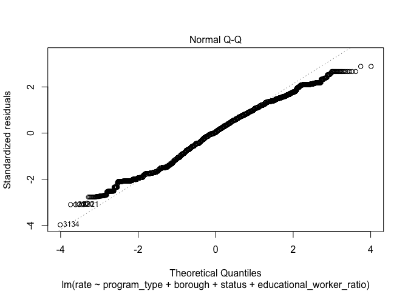

linear
================
2022-12-08

``` r
library(tidyverse)
library(dplyr)
library(rvest)
library(purrr)
library(ggplot2)
library(modelr)
library(mgcv)
library(patchwork)
library(viridis)
library(fastDummies)
set.seed(1)
```

1.  Import original dataset

2.  Remove repeated data

``` r
childcare_inspection_df = read_csv("./data/DOHMH_Childcare_Center_Inspections.csv") %>% 
janitor::clean_names() %>% 
distinct()
```

    ## Rows: 26280 Columns: 34
    ## ── Column specification ─────────────────────────────────────────────
    ## Delimiter: ","
    ## chr (22): Center Name, Legal Name, Building, Street, Borough, Phone, Permit ...
    ## dbl (11): ZipCode, Permit Number, Building Identification Number, Violation ...
    ## 
    ## ℹ Use `spec()` to retrieve the full column specification for this data.
    ## ℹ Specify the column types or set `show_col_types = FALSE` to quiet this message.

Basic data cleaning

1.  We select 22 key variables in this dataset to finish our analysis

2.  Drop NA

3.  Create a new variable “educational_worker_ratio”

4.  Make all data in “program_type” and “facility_type” columns show in
    the same format : lower case

``` r
childcare_inspection_df = childcare_inspection_df %>% 
  select(center_name, borough, zip_code, status, age_range, maximum_capacity,program_type, facility_type, 
         child_care_type, violation_category,
         violation_status,violation_rate_percent:average_critical_violation_rate,regulation_summary,
         inspection_summary_result) %>%
  drop_na(zip_code, age_range, violation_rate_percent,public_health_hazard_violation_rate, critical_violation_rate) %>% 
  filter(maximum_capacity != 0) %>% 
  mutate(
    educational_worker_ratio = total_educational_workers/maximum_capacity,
    program_type = tolower(program_type),
    facility_type = tolower(facility_type),
    borough =  as.factor(borough),
    status = as.factor(status),
    program_type = as.factor(program_type),
    facility_type = as.factor(facility_type),
    child_care_type = as.factor(child_care_type),
    age_range = as.factor(age_range)
  ) 
```

### Linear regression model

*Model selection:*

To explore the possible predictors contributing to the center-specific
violation rate under each program type, we built a linear regression
model. In this model, we focused on the violation rate and properties of
each individual center.

To start with, we created a new variable named “rate”, which represents
the violation rate for each center, by using violation category column.
Here, rate = number of total violation for each center and program /
number of total inspection for each center and program, during the past
3 year. This variable was used as the outcome of the linear regression.

``` r
center_specific_df = childcare_inspection_df %>% 
  relocate(center_name, program_type) %>% 
  group_by(center_name, program_type) %>% 
  mutate(
    n_na = sum(is.na(violation_category)), 
    n_violation = sum(!is.na(violation_category)), 
    rate = n_violation/(n_violation + n_na)) %>% 
  arrange(center_name, program_type)
```

Next, we selected several variables closely related to the properties of
each center, as the potential predictors. After a thorough literature
review, we chose variables based on a hypothesized structure for the
factors underlying violation rate.

Linear model 1:

First, we fit a full model using program type, borough, status,
educational worker ratio of center-specific distinct records.

``` r
# select distinct records and related variables of each center
center_distinct_df = center_specific_df %>%
  select(center_name, program_type, borough, status, maximum_capacity, total_educational_workers, educational_worker_ratio, rate)

# fit the full model
full_lm = center_distinct_df %>%
 lm(rate ~ program_type + borough + status + educational_worker_ratio, data = .) 

full_lm %>% 
  broom::tidy() %>%
  knitr::kable(digit = 3)
```

| term                        | estimate | std.error | statistic | p.value |
|:----------------------------|---------:|----------:|----------:|--------:|
| (Intercept)                 |    0.864 |     0.015 |    57.360 |   0.000 |
| program_typeinfant toddler  |   -0.028 |     0.011 |    -2.422 |   0.015 |
| program_typepreschool       |   -0.004 |     0.009 |    -0.442 |   0.658 |
| program_typeschool age camp |    0.116 |     0.141 |     0.823 |   0.410 |
| boroughBROOKLYN             |   -0.244 |     0.006 |   -42.772 |   0.000 |
| boroughMANHATTAN            |   -0.186 |     0.006 |   -30.276 |   0.000 |
| boroughQUEENS               |   -0.104 |     0.006 |   -17.263 |   0.000 |
| boroughSTATEN ISLAND        |   -0.323 |     0.010 |   -32.242 |   0.000 |
| statusExpired-In Renewal    |   -0.190 |     0.012 |   -15.799 |   0.000 |
| statusPermitted             |   -0.239 |     0.011 |   -21.115 |   0.000 |
| educational_worker_ratio    |   -0.083 |     0.015 |    -5.346 |   0.000 |

Linear model 2:

Second, we also proposed an alternative model by using maximum_capacity,
total educational workers and their interaction term as the predictors,
instead of the educational worker ratio.

``` r
# fit an alternative model
alt_lm = center_distinct_df %>%
 lm(rate ~ program_type + borough + status + maximum_capacity * total_educational_workers, data = .) 

alt_lm %>% 
  broom::tidy() %>%
  knitr::kable(digit = 3)
```

| term                                       | estimate | std.error | statistic | p.value |
|:-------------------------------------------|---------:|----------:|----------:|--------:|
| (Intercept)                                |    0.842 |     0.017 |    50.964 |   0.000 |
| program_typeinfant toddler                 |   -0.041 |     0.012 |    -3.425 |   0.001 |
| program_typepreschool                      |   -0.006 |     0.011 |    -0.551 |   0.582 |
| program_typeschool age camp                |    0.129 |     0.141 |     0.917 |   0.359 |
| boroughBROOKLYN                            |   -0.247 |     0.006 |   -43.417 |   0.000 |
| boroughMANHATTAN                           |   -0.187 |     0.006 |   -30.358 |   0.000 |
| boroughQUEENS                              |   -0.106 |     0.006 |   -17.658 |   0.000 |
| boroughSTATEN ISLAND                       |   -0.329 |     0.010 |   -32.928 |   0.000 |
| statusExpired-In Renewal                   |   -0.182 |     0.012 |   -15.253 |   0.000 |
| statusPermitted                            |   -0.231 |     0.011 |   -20.555 |   0.000 |
| maximum_capacity                           |    0.000 |     0.000 |     2.567 |   0.010 |
| total_educational_workers                  |    0.000 |     0.000 |     0.189 |   0.850 |
| maximum_capacity:total_educational_workers |    0.000 |     0.000 |    -0.647 |   0.518 |

After comparing these two models, we decided to keep full_lm model, due
to its better goodness of fit and lower correlation among variables.

``` r
# assess multicollinearity by vif
library(performance) 
check_collinearity(full_lm) # low correlation
```

    ## # Check for Multicollinearity
    ## 
    ## Low Correlation
    ## 
    ##                      Term  VIF   VIF 95% CI Increased SE Tolerance
    ##              program_type 1.78 [1.74, 1.82]         1.33      0.56
    ##                   borough 1.12 [1.10, 1.14]         1.06      0.89
    ##                    status 1.38 [1.35, 1.40]         1.17      0.73
    ##  educational_worker_ratio 1.46 [1.43, 1.49]         1.21      0.69
    ##  Tolerance 95% CI
    ##      [0.55, 0.57]
    ##      [0.88, 0.91]
    ##      [0.71, 0.74]
    ##      [0.67, 0.70]

``` r
check_collinearity(alt_lm)  # moderate correlation
```

    ## # Check for Multicollinearity
    ## 
    ## Low Correlation
    ## 
    ##              Term  VIF   VIF 95% CI Increased SE Tolerance Tolerance 95% CI
    ##      program_type 1.95 [1.90, 1.99]         1.40      0.51     [0.50, 0.52]
    ##           borough 1.12 [1.11, 1.14]         1.06      0.89     [0.87, 0.90]
    ##            status 1.36 [1.34, 1.39]         1.17      0.73     [0.72, 0.75]
    ##  maximum_capacity 1.70 [1.66, 1.73]         1.30      0.59     [0.58, 0.60]
    ## 
    ## Moderate Correlation
    ## 
    ##                                        Term  VIF   VIF 95% CI Increased SE
    ##                   total_educational_workers 5.95 [5.78, 6.12]         2.44
    ##  maximum_capacity:total_educational_workers 6.09 [5.92, 6.26]         2.47
    ##  Tolerance Tolerance 95% CI
    ##       0.17     [0.16, 0.17]
    ##       0.16     [0.16, 0.17]

*Model diagnostics:*

We checked the assumptions of the residuals by using 4 plots as follows.
We found:

1.  Linearity and homoscedasticity: from the Residuals vs Fitted plot,
    we can see residuals form a horizontal ‘band’ around zero and its
    value evenly dispersed around this reference line, suggesting the
    variance of our residuals should be constant across all fitted
    values.

2.  Normality: from the Normal QQ plot, we can see a straight line with
    small departures if we don’t consider cases 3134 and 12320,
    suggesting the residuals follows a normal distribution.

3.  Equal variance: again, from the Scale_Location plot, we can see a
    horizontal line with roughly equally spread points, suggesting the
    residuals are spread equally along the range of the predictors.

4.  Outliers: from the Residuals vs Leverage plot, we can see case 3134
    is outside of the dashed line of Cook’s distance 0.5, suggesting
    they might be influential observations. Moreover, from other plots
    we can also find cases 3134 and 12320 kept showing up as outliers.

``` r
# model diagnostics: Residuals vs Fitted plot, QQ plot, Scale_location, Residuals vs Leverage
plot(full_lm)
```

<!-- --><!-- --><!-- --><!-- -->

*Remedy:*

Therefore, to address the slight model violation issue, we firstly tried
transformation to makes the data more ‘normal’. From the boxplot of two
numerical variables rate and educational worker ratio we can see the
latter is right skewed.

Since there are 0 value in these variables, log-transformation is not
applicable. Then we did square root transformation to the variable
educational_worker_ratio. However, this step didn’t significantly
improved the model.So we decided to go without transformation.

``` r
# Boxblot to check the initial distribution of outcome and key predictor
center_distinct_df  %>%
par(mfrow = c(1,2))
```

    ## Warning in par(., mfrow = c(1, 2)): argument 1 does not name a graphical
    ## parameter

``` r
boxplot(center_distinct_df$educational_worker_ratio, main = "Edu-worker Ratio")
boxplot(center_distinct_df$rate, main = "Violation Rate")
```

<!-- -->

``` r
# Square root transformation
full_lm_sqrt = center_distinct_df %>%
  lm(rate ~ program_type + borough + status + sqrt(educational_worker_ratio), data = .)
```

In addition, we removed influential point 3134 and fit a new model named
full_lm_out. This model works better then full_lm.

``` r
# exclude two influential records
out_df = center_distinct_df[-c(3134),]

# fit model without influential points
full_lm_out = lm(rate ~ program_type + borough + status + educational_worker_ratio, data = out_df)

full_lm_out %>% 
  broom::tidy() %>%
  knitr::kable(digit = 3)
```

| term                        | estimate | std.error | statistic | p.value |
|:----------------------------|---------:|----------:|----------:|--------:|
| (Intercept)                 |    0.865 |     0.015 |    57.407 |   0.000 |
| program_typeinfant toddler  |   -0.028 |     0.011 |    -2.425 |   0.015 |
| program_typepreschool       |   -0.004 |     0.009 |    -0.446 |   0.656 |
| program_typeschool age camp |    0.511 |     0.172 |     2.970 |   0.003 |
| boroughBROOKLYN             |   -0.245 |     0.006 |   -42.838 |   0.000 |
| boroughMANHATTAN            |   -0.186 |     0.006 |   -30.365 |   0.000 |
| boroughQUEENS               |   -0.104 |     0.006 |   -17.315 |   0.000 |
| boroughSTATEN ISLAND        |   -0.323 |     0.010 |   -32.285 |   0.000 |
| statusExpired-In Renewal    |   -0.190 |     0.012 |   -15.804 |   0.000 |
| statusPermitted             |   -0.239 |     0.011 |   -21.128 |   0.000 |
| educational_worker_ratio    |   -0.083 |     0.015 |    -5.342 |   0.000 |

``` r
# model diagnostics: Residuals vs Fitted plot, QQ plot, Scale_location, Residuals vs Leverage
plot(full_lm_out)
```

<!-- --><!-- --><!-- --><!-- -->

*Model validation:*

We used 5-fold cross validation to test the model performance. Based on
a rule of thumb, RMSE values between 0.2 and 0.5 shows that the model
can relatively predict the data accurately. Thus our model boasts good
RMSE value, suggesting relatively good predictive ability.

``` r
library(caret)
# Use 5-fold validation and create the training sets
train = trainControl(method = "cv", number = 5)

model_caret = train(rate ~ program_type + borough + status + educational_worker_ratio,
                   data = out_df,
                   trControl = train,
                   method = 'lm',
                   na.action = na.pass)

model_caret$finalModel
```

    ## 
    ## Call:
    ## lm(formula = .outcome ~ ., data = dat)
    ## 
    ## Coefficients:
    ##                   (Intercept)   `program_typeinfant toddler`  
    ##                       0.86475                       -0.02760  
    ##         program_typepreschool  `program_typeschool age camp`  
    ##                      -0.00422                        0.51132  
    ##               boroughBROOKLYN               boroughMANHATTAN  
    ##                      -0.24476                       -0.18643  
    ##                 boroughQUEENS         `boroughSTATEN ISLAND`  
    ##                      -0.10384                       -0.32338  
    ##    `statusExpired-In Renewal`                statusPermitted  
    ##                      -0.18964                       -0.23890  
    ##      educational_worker_ratio  
    ##                      -0.08251

``` r
print(model_caret)
```

    ## Linear Regression 
    ## 
    ## 16453 samples
    ##     4 predictor
    ## 
    ## No pre-processing
    ## Resampling: Cross-Validated (5 fold) 
    ## Summary of sample sizes: 13162, 13162, 13163, 13163, 13162 
    ## Resampling results:
    ## 
    ##   RMSE       Rsquared   MAE      
    ##   0.2432694  0.1562276  0.1983364
    ## 
    ## Tuning parameter 'intercept' was held constant at a value of TRUE

*Conclusion:*

We chose full_lm_out as our final linear model:

rate = 0.865 + 0.511(program_type_school age camp) -
0.245(borough_BROOKLYN) -0.186(borough_MANHATTAN) -
0.104(borough_QUEENS) - 0.323(borough_STATEN ISLAND) -
0.19(status_Expired In Renewal) - 0.239(status_Permitted) -
0.083(educational_worker_ratio)

Interpretation:

In this model, the outcome is “rate”, indicating the violation rate for
each center based on different program type. Our key predictor is the
numeric variable of “educational_worker_ratio”, which is the
program-specific total number of educational worker in each center,
divided by the maximum capacity, based on the square footage of class
and play rooms, the number of toilets and sinks, and overall estimates
from the NYC Department of Buildings. Our model suggests the value of
the estimated mean violation rate decreases by 0.083 for each unit
increase in educational worker ratio, while holding all other variables
fixed.

We also included several categorical variables into our model. Based on
the output, the interpretations of coefficients estimates are as
follows:

The value of the estimated mean violation rate for centers located in
Brooklyn, Manhattan, Queens and Staten island are 0.245, 0.186, 0.104
and 0.323 less than centers located in Bronx, respectively, while
holding other variables constant.

The value of the estimated mean violation rate for centers with licence
status as expired in renewal and as permitted is 0.19 and 0.239 less
than centers with licence status as active, while holding other
variables constant.

The value of the estimated mean violation rate for centers implement
school age camp program is 0.511 more than centers implement all age
camp program, while holding other variables constant.
