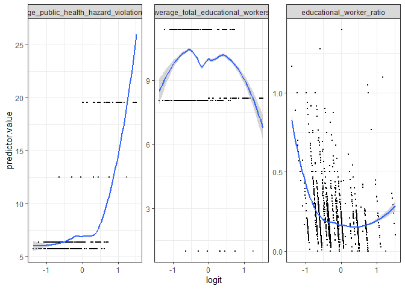
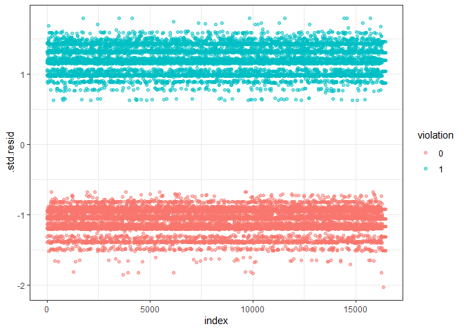

logistic regression
================
Han Bao
2022-12-08

``` r
library(tidyverse)
library(broom)
library(viridis)
library(purrr)
library(modelr)
theme_set(theme_classic())
```

``` r
child_data = read_csv("./data/DOHMH_Childcare_Center_Inspections.csv") %>%
  janitor::clean_names()%>%
  distinct()
```

``` r
child_data = child_data %>% 
  select(center_name, borough, zip_code, status, age_range, maximum_capacity,program_type, facility_type, 
         child_care_type, violation_category,
         violation_status,violation_rate_percent:average_critical_violation_rate,regulation_summary,
         inspection_summary_result) %>%
  drop_na(zip_code, age_range, violation_rate_percent,public_health_hazard_violation_rate, critical_violation_rate) %>% 
  filter(maximum_capacity != 0) %>% 
  mutate(
    educational_worker_ratio = total_educational_workers/maximum_capacity,
    program_type = tolower(program_type),
    facility_type = tolower(facility_type),
    borough =  as.factor(borough),
    status = as.factor(status),
    program_type = as.factor(program_type),
    facility_type = as.factor(facility_type),
    child_care_type = as.factor(child_care_type)
  )
```

``` r
#create binary variable according to regulation_summary
child_data <- child_data %>%
  mutate(violation = if_else(.$regulation_summary == 'There were no new violations observed at the time of this inspection/visit.','0','1'),
         violation = as.factor(violation))
```

``` r
head(child_data, 10)
```

    ## # A tibble: 10 × 23
    ##    center_name    borough zip_c…¹ status age_r…² maxim…³ progr…⁴ facil…⁵ child…⁶
    ##    <chr>          <fct>     <dbl> <fct>  <chr>     <dbl> <fct>   <fct>   <fct>  
    ##  1 TRADITIONAL E… BROOKL…   11221 Expir… 0 YEAR…      60 infant… gdc     Child …
    ##  2 BOYS & GIRL S… BROOKL…   11212 Expir… 0 YEAR…      60 all ag… camp    Camp   
    ##  3 ITTY BITTY AD… BROOKL…   11234 Permi… 2 YEAR…      42 presch… gdc     Child …
    ##  4 MAGIC MOMENTS… BROOKL…   11238 Permi… 2 YEAR…      24 presch… gdc     Child …
    ##  5 YELED VYALDA … BROOKL…   11213 Expir… 2 YEAR…      75 presch… gdc     Child …
    ##  6 EAST SIDE HOU… BRONX     10454 Expir… 2 YEAR…      80 presch… gdc     Child …
    ##  7 NAT AZAROW CH… BROOKL…   11212 Permi… 2 YEAR…      98 presch… gdc     Child …
    ##  8 BRIGHT START … QUEENS    11101 Permi… 2 YEAR…      72 presch… gdc     Child …
    ##  9 UNIVERSITY SE… BROOKL…   11201 Expir… 0 YEAR…     550 all ag… camp    Camp   
    ## 10 THE FRIENDS O… BROOKL…   11213 Permi… 2 YEAR…     100 presch… gdc     Child …
    ## # … with 14 more variables: violation_category <chr>, violation_status <chr>,
    ## #   violation_rate_percent <dbl>, average_violation_rate_percent <dbl>,
    ## #   total_educational_workers <dbl>, average_total_educational_workers <dbl>,
    ## #   public_health_hazard_violation_rate <dbl>,
    ## #   average_public_health_hazard_violation_rate <dbl>,
    ## #   critical_violation_rate <dbl>, average_critical_violation_rate <dbl>,
    ## #   regulation_summary <chr>, inspection_summary_result <chr>, …

\###Fit the logistic regression model \#fit a logistic regression with
violation vs no violation as the outcome and the rest as predictors.And
Obtain the estimate and CI of the adjusted odds ratio for having
violation.

``` r
model_log <- glm(violation ~borough + status  + program_type + facility_type + child_care_type + average_total_educational_workers+average_public_health_hazard_violation_rate+educational_worker_ratio,data = child_data,family = binomial(link=logit))
model_log %>%
  broom::tidy(conf.int = T) %>% 
  mutate(OR = exp(estimate),
         CI_lower = exp(exp(conf.low)),
         CI_upper = exp(exp(conf.high)),
         p_val = rstatix::p_format(p.value, digits = 2)) %>% 
  select(term, OR, CI_lower,CI_upper, p_val) %>% 
  knitr::kable(digits = 3, align = "lccc", 
               col.names = c("Term", "Estimated adjusted OR", "CI lower bound", "CI upper bound", "p-value"))
```

| Term                                         | Estimated adjusted OR | CI lower bound | CI upper bound | p-value  |
|:---------------------------------------------|:---------------------:|:--------------:|:--------------:|:---------|
| (Intercept)                                  |         4.715         |     38.429     |  4.501930e+02  | \<0.0001 |
| boroughBROOKLYN                              |         0.351         |     1.376      |  1.472000e+00  | \<0.0001 |
| boroughMANHATTAN                             |         0.454         |     1.506      |  1.652000e+00  | \<0.0001 |
| boroughQUEENS                                |         0.648         |     1.798      |  2.045000e+00  | \<0.0001 |
| boroughSTATEN ISLAND                         |         0.247         |     1.230      |  1.342000e+00  | \<0.0001 |
| statusExpired-In Renewal                     |         0.448         |     1.438      |  1.736000e+00  | \<0.0001 |
| statusPermitted                              |         0.355         |     1.337      |  1.541000e+00  | \<0.0001 |
| program_typeinfant toddler                   |         0.908         |     2.123      |  2.992000e+00  | 0.3159   |
| program_typepreschool                        |         1.001         |     2.355      |  3.218000e+00  | 0.9944   |
| program_typeschool age camp                  |         1.644         |     1.164      |  4.762402e+15  | 0.6894   |
| facility_typegdc                             |          NA           |       NA       |       NA       | NA       |
| facility_typesbcc                            |          NA           |       NA       |       NA       | NA       |
| child_care_typeChild Care - Infants/Toddlers |          NA           |       NA       |       NA       | NA       |
| child_care_typeChild Care - Pre School       |          NA           |       NA       |       NA       | NA       |
| child_care_typeSchool Based Child Care       |          NA           |       NA       |       NA       | NA       |
| average_total_educational_workers            |          NA           |       NA       |       NA       | NA       |
| average_public_health_hazard_violation_rate  |          NA           |       NA       |       NA       | NA       |
| educational_worker_ratio                     |         0.706         |     1.721      |  2.503000e+00  | 0.0093   |

``` r
# Predict the probability (p) of violation positivity
probabilities <- predict(model_log, type = "response")
predicted.classes <- ifelse(probabilities > 0.5, "pos", "neg")
head(predicted.classes)
```

    ##     1     2     3     4     5     6 
    ## "neg" "neg" "neg" "neg" "neg" "pos"

``` r
#probabilities
```

``` r
child_data <- child_data %>%
  dplyr::select(average_total_educational_workers,average_public_health_hazard_violation_rate,educational_worker_ratio) 
predictors <- colnames(child_data)
#predictors
```

\###Model diagnostics \#1. Remove categorical variables from the
original data frame and bind the logit values to the data

``` r
#select only numeric preditors
#child_data <- child_data %>%
  #dplyr::select(average_total_educational_workers,average_public_health_hazard_violation_rate,educational_worker_ratio) 
#predictors <- colnames(child_data)
# Bind the logit and tidying the data for plots
child_data <- child_data %>%
  mutate(logit = log(probabilities/(1-probabilities))) %>%
  gather(key = "predictors", value = "predictor.value", -logit)
```

\#2. Create the scatter plots:

``` r
ggplot(child_data, aes(logit, predictor.value))+
  geom_point(size = 0.5, alpha = 0.5) +
  geom_smooth(method = "loess") + 
  theme_bw() + 
  facet_wrap(~predictors, scales = "free_y")
```

    ## `geom_smooth()` using formula 'y ~ x'

<!-- -->

``` r
# Extract model results
model_log.data <- augment(model_log) %>% 
  mutate(index = 1:n()) 
ggplot(model_log.data, aes(index, .std.resid)) + 
  geom_point(aes(color = violation), alpha = .5) +
  theme_bw()
```

<!-- -->
