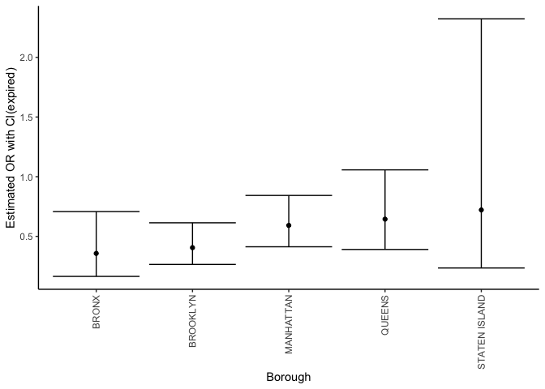
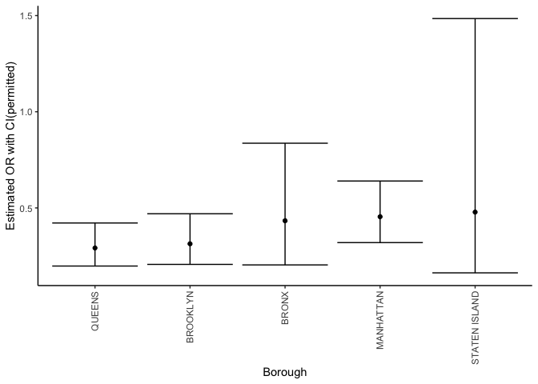
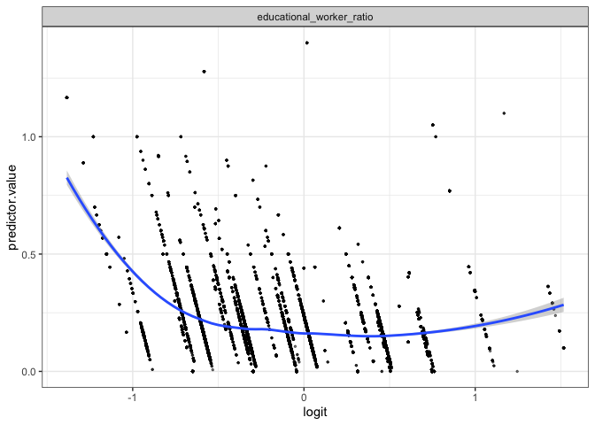
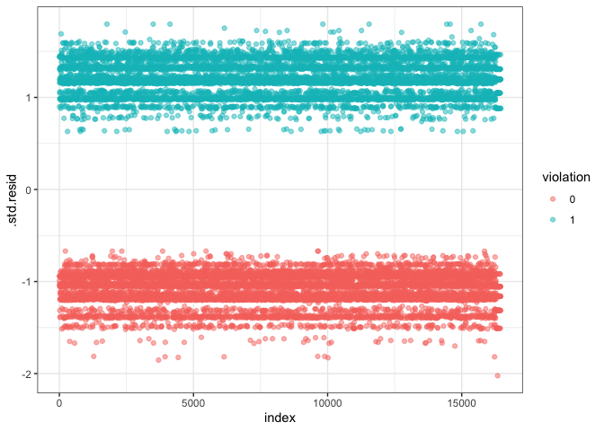

logistic regression
================
Han Bao
12-9-2022

``` r
library(tidyverse)
library(broom)
library(viridis)
library(purrr)
library(modelr)
theme_set(theme_classic())
```

``` r
child_data = read_csv("./data/DOHMH_Childcare_Center_Inspections.csv") %>%
  janitor::clean_names()%>%
  distinct()
```

``` r
child_data = child_data %>% 
  select(center_name, borough, zip_code, status, age_range, maximum_capacity,program_type, facility_type, 
         child_care_type, violation_category,
         violation_status,violation_rate_percent:average_critical_violation_rate,regulation_summary,
         inspection_summary_result) %>%
  drop_na(zip_code, age_range, violation_rate_percent,public_health_hazard_violation_rate, critical_violation_rate) %>% 
  filter(maximum_capacity != 0) %>% 
  mutate(
    educational_worker_ratio = total_educational_workers/maximum_capacity,
    program_type = tolower(program_type),
    facility_type = tolower(facility_type),
    borough =  as.factor(borough),
    status = as.factor(status),
    program_type = as.factor(program_type),
    facility_type = as.factor(facility_type),
    child_care_type = as.factor(child_care_type)
  )
```

``` r
#create binary variable according to regulation_summary
child_data <- child_data %>%
  mutate(violation = if_else(.$regulation_summary == 'There were no new violations observed at the time of this inspection/visit.','0','1'),
         violation = as.factor(violation))
```

``` r
head(child_data, 10)
```

    ## # A tibble: 10 × 23
    ##    center_name    borough zip_c…¹ status age_r…² maxim…³ progr…⁴ facil…⁵ child…⁶
    ##    <chr>          <fct>     <dbl> <fct>  <chr>     <dbl> <fct>   <fct>   <fct>  
    ##  1 TRADITIONAL E… BROOKL…   11221 Expir… 0 YEAR…      60 infant… gdc     Child …
    ##  2 BOYS & GIRL S… BROOKL…   11212 Expir… 0 YEAR…      60 all ag… camp    Camp   
    ##  3 ITTY BITTY AD… BROOKL…   11234 Permi… 2 YEAR…      42 presch… gdc     Child …
    ##  4 MAGIC MOMENTS… BROOKL…   11238 Permi… 2 YEAR…      24 presch… gdc     Child …
    ##  5 YELED VYALDA … BROOKL…   11213 Expir… 2 YEAR…      75 presch… gdc     Child …
    ##  6 EAST SIDE HOU… BRONX     10454 Expir… 2 YEAR…      80 presch… gdc     Child …
    ##  7 NAT AZAROW CH… BROOKL…   11212 Permi… 2 YEAR…      98 presch… gdc     Child …
    ##  8 BRIGHT START … QUEENS    11101 Permi… 2 YEAR…      72 presch… gdc     Child …
    ##  9 UNIVERSITY SE… BROOKL…   11201 Expir… 0 YEAR…     550 all ag… camp    Camp   
    ## 10 THE FRIENDS O… BROOKL…   11213 Permi… 2 YEAR…     100 presch… gdc     Child …
    ## # … with 14 more variables: violation_category <chr>, violation_status <chr>,
    ## #   violation_rate_percent <dbl>, average_violation_rate_percent <dbl>,
    ## #   total_educational_workers <dbl>, average_total_educational_workers <dbl>,
    ## #   public_health_hazard_violation_rate <dbl>,
    ## #   average_public_health_hazard_violation_rate <dbl>,
    ## #   critical_violation_rate <dbl>, average_critical_violation_rate <dbl>,
    ## #   regulation_summary <chr>, inspection_summary_result <chr>, …

\###Fit the logistic regression model

\#fit a logistic regression with violation vs no violation as the
outcome and the rest as predictors.And Obtain the estimate and CI of the
adjusted odds ratio for having violation.

``` r
model_log <- glm(violation ~ borough + status  + program_type + educational_worker_ratio,data = child_data,family = binomial(link=logit))
model_log %>%
  broom::tidy(conf.int = T) %>% 
  mutate(OR = exp(estimate),
         CI_lower = exp(exp(conf.low)),
         CI_upper = exp(exp(conf.high)),
         p_val = rstatix::p_format(p.value, digits = 2)) %>% 
  select(term, OR, CI_lower,CI_upper, p_val) %>% 
  knitr::kable(digits = 3, align = "lccc", 
               col.names = c("Term", "Estimated adjusted OR", "CI lower bound", "CI upper bound", "p-value"))
```

| Term                        | Estimated adjusted OR | CI lower bound | CI upper bound | p-value  |
|:----------------------------|:---------------------:|:--------------:|:--------------:|:---------|
| (Intercept)                 |         4.715         |     38.429     |  4.501930e+02  | \<0.0001 |
| boroughBROOKLYN             |         0.351         |     1.376      |  1.472000e+00  | \<0.0001 |
| boroughMANHATTAN            |         0.454         |     1.506      |  1.652000e+00  | \<0.0001 |
| boroughQUEENS               |         0.648         |     1.798      |  2.045000e+00  | \<0.0001 |
| boroughSTATEN ISLAND        |         0.247         |     1.230      |  1.342000e+00  | \<0.0001 |
| statusExpired-In Renewal    |         0.448         |     1.438      |  1.736000e+00  | \<0.0001 |
| statusPermitted             |         0.355         |     1.337      |  1.541000e+00  | \<0.0001 |
| program_typeinfant toddler  |         0.908         |     2.123      |  2.992000e+00  | 0.3159   |
| program_typepreschool       |         1.001         |     2.355      |  3.218000e+00  | 0.9944   |
| program_typeschool age camp |         1.644         |     1.164      |  4.762402e+15  | 0.6894   |
| educational_worker_ratio    |         0.706         |     1.721      |  2.503000e+00  | 0.0093   |

``` r
# Predict the probability (p) of violation positivity
probabilities <- predict(model_log, type = "response")
predicted.classes <- ifelse(probabilities > 0.5, "pos", "neg")
head(predicted.classes)
```

    ##     1     2     3     4     5     6 
    ## "neg" "neg" "neg" "neg" "neg" "pos"

``` r
#probabilities
```

``` r
summary(model_log)
```

    ## 
    ## Call:
    ## glm(formula = violation ~ borough + status + program_type + educational_worker_ratio, 
    ##     family = binomial(link = logit), data = child_data)
    ## 
    ## Deviance Residuals: 
    ##     Min       1Q   Median       3Q      Max  
    ## -1.8520  -1.0508  -0.8782   1.1727   1.7934  
    ## 
    ## Coefficients:
    ##                               Estimate Std. Error z value Pr(>|z|)    
    ## (Intercept)                  1.5508044  0.1314607  11.797  < 2e-16 ***
    ## boroughBROOKLYN             -1.0465054  0.0487599 -21.462  < 2e-16 ***
    ## boroughMANHATTAN            -0.7905779  0.0518737 -15.240  < 2e-16 ***
    ## boroughQUEENS               -0.4339075  0.0503992  -8.609  < 2e-16 ***
    ## boroughSTATEN ISLAND        -1.3983570  0.0896874 -15.591  < 2e-16 ***
    ## statusExpired-In Renewal    -0.8025015  0.1065993  -7.528 5.14e-14 ***
    ## statusPermitted             -1.0349521  0.1013003 -10.217  < 2e-16 ***
    ## program_typeinfant toddler  -0.0960457  0.0957691  -1.003  0.31591    
    ## program_typepreschool        0.0005541  0.0792675   0.007  0.99442    
    ## program_typeschool age camp  0.4969849  1.2435739   0.400  0.68942    
    ## educational_worker_ratio    -0.3480415  0.1339063  -2.599  0.00935 ** 
    ## ---
    ## Signif. codes:  0 '***' 0.001 '**' 0.01 '*' 0.05 '.' 0.1 ' ' 1
    ## 
    ## (Dispersion parameter for binomial family taken to be 1)
    ## 
    ##     Null deviance: 22719  on 16453  degrees of freedom
    ## Residual deviance: 21933  on 16443  degrees of freedom
    ## AIC: 21955
    ## 
    ## Number of Fisher Scoring iterations: 4

\##We can see from the summary that the licence status and educational
worker ratio of the child care centers are significant predictors of the
violation rate with p-value\< 0.05 while the facility type doesn’t
significantly influence the violation rate with p-value\>0.05.
\###visualization

``` r
#  Extract the adjusted odds ratio (and CI) for having violation comparing licence type of "active" against "Expired-in renewal" from all the boroughs.
all_logistic_E = child_data %>% 
  nest(data = -borough) %>% 
  mutate(
    models = map(data, ~glm(violation ~ status  +  program_type + educational_worker_ratio, data = ., family = binomial(link = "logit"))),
    results = map(models, ~broom::tidy(.x, conf.int = T))) %>% 
  select(borough, results) %>% 
  unnest(results) %>% 
  mutate(
    OR = exp(estimate),
    CI_lower = exp(conf.low),
    CI_upper = exp(conf.high),
    p_val = rstatix::p_format(p.value, digits = 2)
  ) %>% 
  filter(term == "statusExpired-In Renewal") %>% 
  select(borough, OR, CI_lower,CI_upper, p_val) 
all_logistic_E %>% 
  knitr::kable(digits = 3, align = "llccc", col.names = c("Borough", "Estimated adjusted OR", "CI lower bound", "CI upper bound", "p-value"))
```

| Borough       | Estimated adjusted OR | CI lower bound | CI upper bound | p-value  |
|:--------------|:----------------------|:--------------:|:--------------:|:--------:|
| BROOKLYN      | 0.406                 |     0.265      |     0.614      | \<0.0001 |
| BRONX         | 0.357                 |     0.165      |     0.708      | 0.00519  |
| QUEENS        | 0.644                 |     0.390      |     1.057      | 0.08323  |
| MANHATTAN     | 0.592                 |     0.413      |     0.843      | 0.00395  |
| STATEN ISLAND | 0.721                 |     0.235      |     2.323      | 0.56915  |

``` r
all_logistic_P = child_data %>% 
  nest(data = -borough) %>% 
  mutate(
    models = map(data, ~glm(violation ~ status  +  program_type + educational_worker_ratio, data = ., family = binomial(link = "logit"))),
    results = map(models, ~broom::tidy(.x, conf.int = T))) %>% 
  select(borough, results) %>% 
  unnest(results) %>% 
  mutate(
    OR = exp(estimate),
    CI_lower = exp(conf.low),
    CI_upper = exp(conf.high),
    p_val = rstatix::p_format(p.value, digits = 2)
  ) %>% 
  filter(term == "statusPermitted") %>% 
  select(borough, OR, CI_lower,CI_upper, p_val) 
all_logistic_P %>% 
  knitr::kable(digits = 3, align = "llccc", col.names = c("Borough", "Estimated adjusted OR", "CI lower bound", "CI upper bound", "p-value"))
```

| Borough       | Estimated adjusted OR | CI lower bound | CI upper bound | p-value  |
|:--------------|:----------------------|:--------------:|:--------------:|:--------:|
| BROOKLYN      | 0.314                 |     0.206      |     0.470      | \<0.0001 |
| BRONX         | 0.433                 |     0.204      |     0.836      | 0.01894  |
| QUEENS        | 0.292                 |     0.198      |     0.422      | \<0.0001 |
| MANHATTAN     | 0.454                 |     0.320      |     0.640      | \<0.0001 |
| STATEN ISLAND | 0.478                 |     0.162      |     1.485      | 0.18184  |

``` r
# Create a plot showing the estimated ORs and CIs for each borough
all_logistic_E %>% 
  mutate(borough = fct_reorder(borough, OR)) %>%
  ggplot(aes(x = borough, y = OR)) +
  geom_point() +
  geom_errorbar(aes(ymin = CI_lower, ymax = CI_upper)) +
  theme(axis.text.x = element_text(angle = 90, vjust = 0.5, hjust = 1)) +
  labs(x = "Borough", y = "Estimated OR with CI(expired)")
```

<!-- -->

``` r
all_logistic_P %>% 
  mutate(borough = fct_reorder(borough, OR)) %>%
  ggplot(aes(x = borough, y = OR)) +
  geom_point() +
  geom_errorbar(aes(ymin = CI_lower, ymax = CI_upper)) +
  theme(axis.text.x = element_text(angle = 90, vjust = 0.5, hjust = 1)) +
  labs(x = "Borough", y = "Estimated OR with CI(permitted)")
```

<!-- -->

\##From these two plots we can see that in Brooklyn, Bronx and
Manhattan, the 95% confidence interval of odds ratio doesn’t include 1
and this tells us that in these three regions, cases with licence status
of active generally have less violation than cases with status of
expired or in-renewal. Similarly, in Brooklyn, Bronx, Queens and
Manhattan, the 95% confidence interval of odds ratio doesn’t include 1
and this tells us that in these four regions, cases with licence status
of active generally have less violation than cases with status of
permitted. \###Model diagnostics \#1. Remove categorical variables from
the original data frame and bind the logit values to the data

``` r
#select only numeric predictors
child_data <- child_data %>%
  dplyr::select(educational_worker_ratio) 
predictors <- colnames(child_data)
child_data <- child_data %>%
  mutate(logit = log(probabilities/(1-probabilities))) %>%
  gather(key = "predictors", value = "predictor.value", -logit)
```

\#2. Create the scatter plots:

``` r
ggplot(child_data, aes(logit, predictor.value))+
  geom_point(size = 0.5, alpha = 0.5) +
  geom_smooth(method = "loess") + 
  theme_bw() + 
  facet_wrap(~predictors, scales = "free_y")
```

    ## `geom_smooth()` using formula 'y ~ x'

<!-- -->

\##From this plot we can see that variable educational_worker_ratio is
quite linearly associated with the violation rate in logit scale.

``` r
# Extract model results
model_log.data <- augment(model_log) %>% 
  mutate(index = 1:n()) 
ggplot(model_log.data, aes(index, .std.resid)) + 
  geom_point(aes(color = violation), alpha = .5) +
  theme_bw()
```

<!-- -->

\###Diagnostic Conclusion From the plot we can see that the standard
deviation of the data are all in acceptable region which means there’s
no significant outliers in the dataset.

\###Model interpretation In this model, the outcome is log of odds ratio
of violation rate. Our key predictor is the numeric variable of
“educational_worker_ratio”, which is the program-specific total number
of educational worker in each center, divided by the maximum capacity,
based on the square footage of class and play rooms, the number of
toilets and sinks, and overall estimates from the NYC Department of
Buildings. With the log of odds ratio for the association between
violation and educational_worker_ratio = -0.34, holding other variables
fixed, the odds of having the violation will decrease by 29%, for one
unit increase in educational worker ratio.

We also included several categorical variables into our model. Based on
the output, the interpretations of coefficients estimates are as
follows: with log(odds ratio) = -1.04, -0.79, -0.33 and -1.40, the odds
of having violation in Brooklyn, Manhattan, Queens and Staten island is
0.35, 0.45, 0.65 and 0.24 times of that in Bronx. with log(odds ratio) =
-0.80 and -1.03, the odds of having violation in centers with
“expired-in renewal” and “permitted” license is 0.45 and 0.36 times of
that among centers with “active” license
